# An Analysis into the MOBA E-Sports Game - League of Legends

League of Legends is a Multiplayer Online Battle Arena (MOBA) video game that has become one of the most popular games in the world over the last 10 years. For those who have never heard of the game, or don't know how it works, this video is a great introduction: https://www.youtube.com/watch?v=BGtROJeMPeE. 

With the rise of popularity of E-Sports in main stream media and across cultures, League of Legends has become the poster child in the recent E-Sports world, in terms of viewership and revenue generation. National Basketball Association (NBA) organizations are starting to take ownership in these teams, and are starting to see a future for marketing their brand and generating revenue. Given this has been evolving over the last few years, sports analytics practices within the realm of video games is relatively new. With access to thousands of game stats via Riot's API, we are allowed to understand how the game is played amongst the public, and what factors of the game account for winning. 

### Abstract

What I attempted to explore through data exploration and modeling was to understand the components that are needed for teams to win throughout the duration of the game. Beyond the main objective of the game, there are underlying pieces of the game that can give teams an advantage of achieving the main objective first that aren't so obvious. I want to develop fundamental concepts of the game that will make players more efficient and could increase player's chances of winning. This analysis is a look at over 150,000 public games played from players across the globe, in hopes of understanding some key concepts when it comes to winning this game.

Some areas of the game this analysis explores are:

1) What statistics of the game are important for winning? Does their importance change for shorter games vs longer games?

2) What characteristics of team vision of the map differ between winning and losing teams? Is there a difference between roles?

3) What is the differing characteristics between winning teams and losing teams in regards to gold accumulation?

4) How likely is a team to win based on getting specific objectives first before the opposing team?

5) Do specific champions tend to win more than other champions? How about champions played in specific roles?

6) Are there champions that are better to play against other champions?

7) How can we predict which team will win before a game has started?

My key findings into exploring these questions further are:

1) In the beginning of the game, the main focus of gaining advantages over your opponent is acquiring gold. Gold leads to items that provide the advantages. The more gold you can acquire over your opponent over time results in better chances of winning the game. Gold is usually acquired in the beginning of the game from a few sources:

    1) Destroying Minions
    
    2) Getting Champion Kills
    
2) If a game duration extends (usually past 30 minutes), the focus of the game can become more macro that just acquiring gold. The advantages gain in the early game by acquiring gold and buying items eventually levels out, as there is a cap to how many items players can purchase. The focust of the game turns more into:

    1) How can we destroy turrets and inhibitors more efficiently than our opponents?
    
    2) How can we defend our base?
    
    3) How can our team composition be used to our advantage to winning?
    
    4) What neutral objectives should we focus on that can help us win?
    
3) There is a clear difference between winning and losing teams in regards to how many wards each team places in a game

4) There are clear advantages that some champions have over others and can be used to create advantages right at the beginning of the game

5) Predicting games before they start are greatly influences by a few factors:

    1) What champions were selected by each team?
    
    2) How well does a champion match up against their opponent's champion?
    
    3) How good is a player at playing that champion?
    
    4) How well has the player played in recent games?
    
Based on these findings a few recommendations I would provide to solidifying the fundamentals in teaching the game to someone would be:

1) Learn what champions are better in matchups against other champions

2) The most important parts of the early game for any player is to acquire gold better than their opponent to gain advantages

3) In the later phases of the game, understanding the macro strategies becomes the main focus for winning

4) Your odds of winning a game reflect the above items, plus having teammates that are comfortable with playing their selected champion

# Statistics that correlate with winning

I first wanted to create a baseline statistic for winning. I calculated below what percent of blue teams win and what percent of red teams win. Think of these like home teams and away teams. We can see our baseline statistic that if we predicted the blue team to win every game, we would have about a 51% chance of being correct, basically a coin toss.


```python
raw_df['team'] = raw_df['team'].map({'1': 'Blue', '2':'Red'})

def team_win_percent(dframe):
    blue_wins = len(dframe[(dframe.team == "Blue") & (dframe.win == 1)])
    red_wins = len(dframe[(dframe.team == "Red") & (dframe.win == 1)])
    tot_wins = len(dframe[dframe.win==1])
    print('Percent of Total Wins to Blue Team:', round(blue_wins/tot_wins*100,2),'%')
    print('Percent of Total Wins to Red Team:', round(red_wins/tot_wins*100,2),'%')
    
team_win_percent(raw_df)
```

    Percent of Total Wins to Blue Team: 51.3 %
    Percent of Total Wins to Red Team: 48.7 %
    

Taking statistics from the raw dataframe, I created multiple correlation matrix to see the correlations between them and whether the team won or not to understand their importance towards winning. I created the matrix's for games based on different durations, to see how some statistical importance changes. I created a correlation matrix for games based on the following durations:

1) All games

2) Games less than 20 minutes (this is when a team is allowed to surrender early)

3) Games between 20 and 30 minutes

4) Games between 30 and 40 minutes

5) Games longer than 40 minutes


```python
#code for creating the matrix.
df_corr = cor_df._get_numeric_data()

mask = np.zeros_like(df_corr.corr(), dtype=np.bool)
mask[np.triu_indices_from(mask)] = True
cmap = sns.diverging_palette(10, 150,  as_cmap=True)

plt.figure(figsize=(20,20))
sns.heatmap(df_corr.corr(), cmap = cmap, annot = True, fmt = '.2f', mask= mask, square=True, linewidths = .5, center = 0)
plt.title('Correlations - Win vs Factors (all games)')
```


    Text(0.5, 1.0, 'Correlations - Win vs Factors (all games)')


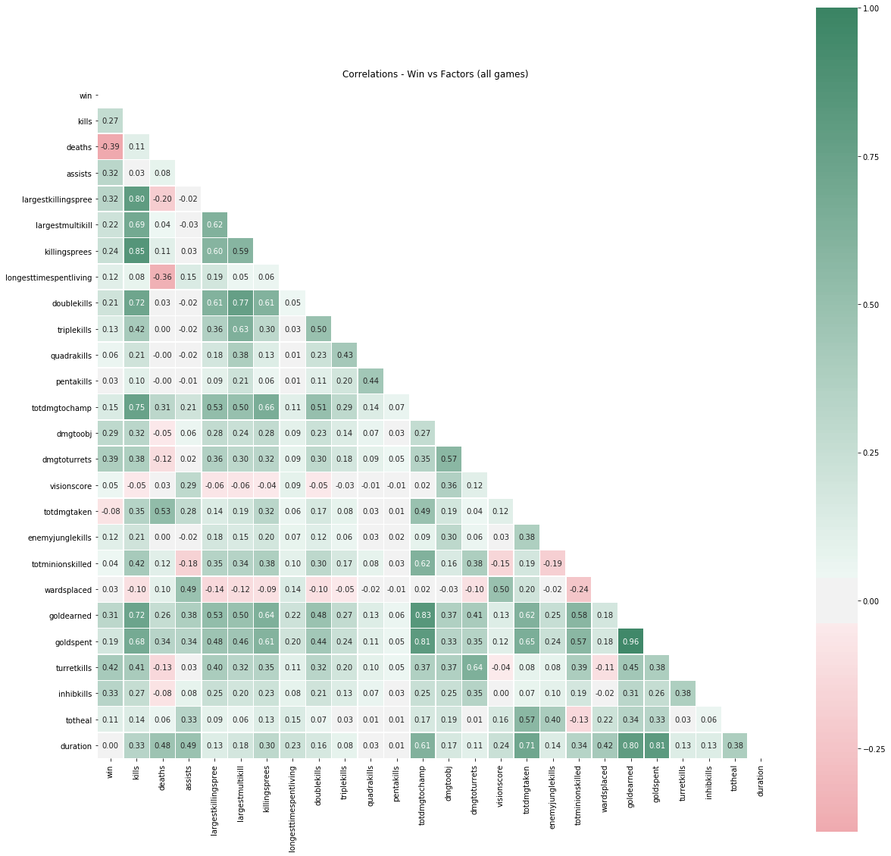


```python
df_corr_2 = cor_df._get_numeric_data()
# for games less than 20mins
df_corr_2 = df_corr_2[df_corr_2['duration'] <= 1200]

mask = np.zeros_like(df_corr_2.corr(), dtype=np.bool)
mask[np.triu_indices_from(mask)] = True
cmap = sns.diverging_palette(10, 150, as_cmap=True)

plt.figure(figsize = (20,20))
sns.heatmap(df_corr_2.corr(), cmap = cmap, annot = True, fmt = '.2f', mask = mask, square=True, linewidths=.5, center = 0)
plt.title('Correlations - win vs factors (for games less than 20 mins)')
```


    Text(0.5, 1.0, 'Correlations - win vs factors (for games less than 20 mins)')


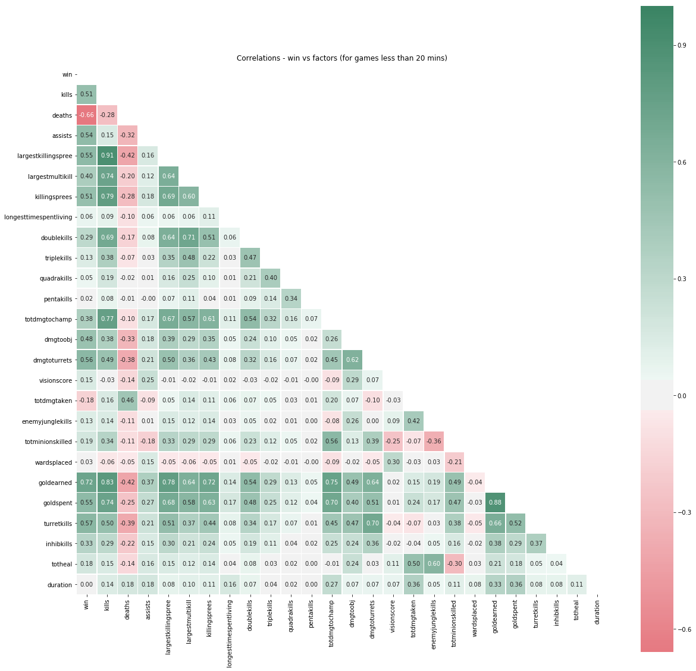


```python
df_corr_2 = cor_df._get_numeric_data()
# for games between 20 and 30mins
df_corr_2 = df_corr_2[(df_corr_2['duration'] > 1200) & (df_corr_2['duration'] <= 1800) ]


mask = np.zeros_like(df_corr_2.corr(), dtype=np.bool)
mask[np.triu_indices_from(mask)] = True
cmap = sns.diverging_palette(10, 150, as_cmap=True)

plt.figure(figsize = (20,20))
sns.heatmap(df_corr_2.corr(), cmap = cmap, annot = True, fmt = '.2f', mask = mask, square=True, linewidths=.5, center = 0)
plt.title('Correlations - win vs factors (for games between 20 and 30 mins)')
```


    Text(0.5, 1.0, 'Correlations - win vs factors (for games between 20 and 30 mins)')


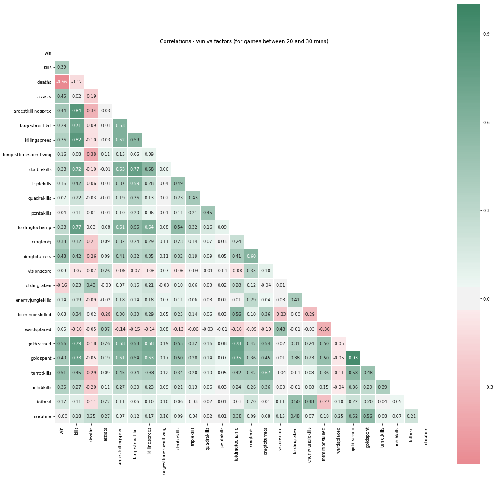


```python
df_corr_2 = cor_df._get_numeric_data()
# for games between 30 and 40 mins
df_corr_2 = df_corr_2[(df_corr_2['duration'] > 1800) & (df_corr_2['duration'] <= 2400)]


mask = np.zeros_like(df_corr_2.corr(), dtype=np.bool)
mask[np.triu_indices_from(mask)] = True
cmap = sns.diverging_palette(10, 150, as_cmap=True)

plt.figure(figsize = (20,20))
sns.heatmap(df_corr_2.corr(), cmap = cmap, annot = True, fmt = '.2f', mask = mask, square=True, linewidths=.5, center = 0)
plt.title('Correlations - win vs factors (for games between 30 and 40 mins)')
```


    Text(0.5, 1.0, 'Correlations - win vs factors (for games between 30 and 40 mins)')


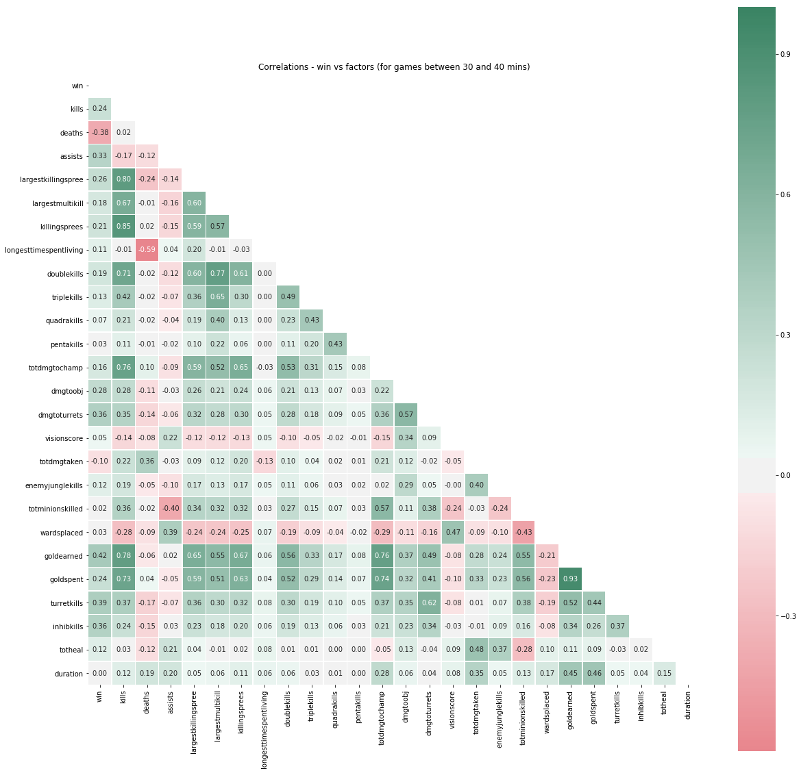


```python
df_corr_2 = cor_df._get_numeric_data()
# for games more than 40 mins
df_corr_2 = df_corr_2[df_corr_2['duration'] > 2400]

mask = np.zeros_like(df_corr_2.corr(), dtype=np.bool)
mask[np.triu_indices_from(mask)] = True
cmap = sns.diverging_palette(10, 150, as_cmap=True)

plt.figure(figsize = (20,20))
sns.heatmap(df_corr_2.corr(), cmap = cmap, annot = True, fmt = '.2f', mask = mask, square=True, linewidths=.5, center = 0)
plt.title('Correlations - win vs factors (for games longer than 40 mins)')
```


    Text(0.5, 1.0, 'Correlations - win vs factors (for games longer than 40 mins)')


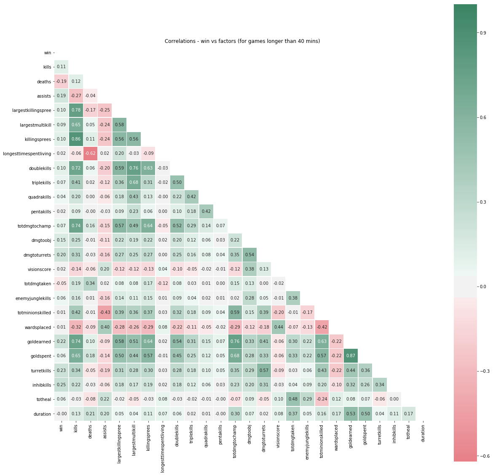


### Findings:

1) The biggest correlations towards winning in general are turret kills, inhibitor kills, and champion kills/ deaths. This makes sense, as the only way to win the game is to destroy the opponents Nexus (home base), and the only way to do that is to first take down their turrets and then their inhibitors. Killing opponents is technically not necessary to win, but is unavoidable in a competitive match and is part of what creates advantages for teams.

2) For games that last less than 20 minutes champion kills/deaths have a much higher correlation towards winning. The reason for this is that games that end so quickly are usually the result of one team achieving numerous kills early in the game to the point where they are just too powerful to counter. This is known in the league of legends world as "snowballing".

3) As game durations become longer and longer, we can see that the correlations towards champion kills/deaths become less and less correlated, and turret and inhibitor kills become more and more correlate. This is because as a game progresses into longer and longer durations, there are caps towards what an individual player can do to make their champion have an advantage over their opponents:

    1) A Champions level caps at 18
    2) A Champion can only hold 6 items
    
So as a game progresses, it will get to a point where all players have their champions maxed out in terms of levels and items, and then it becomes a game of who can seige on their opponents base.

Based on these findings, as part of a basic strategy for any game, getting kills and accumulating gold early in the game is extremely important for a team's success. But as the game gets later into its duration, players will eventually hit their caps in terms of levels and items, and the game will become more of a macro decision type game.
    
 


# Warding differences between winning teams and losing teams

Warding is a part of the game where players can purchase and use what are called "Wards" to provide vision of an area on the map where the ward is placed. The game map has a "fog of war" element to it, which means each team can only see what their players can see, what their turrets and base can see, and what their minions can see. The only way to increase this vision to more areas on the map is to place wards. Wards are the way of tracking where players are on the map, which provides information on the opponent to help makes decisions as to what to do next.

To help me understand ward placing for winning and losing teams, I decided to create violin plots which show me both what a histogram and what a boxplot would show. I am able to determine the averages and frequencies of ward placement for both winning and losing teams. I created the violin plots based on a few factors:

1) how has ward placement changes through the seasons?

2) how is ward placement different between roles?

3) how has ward placement changes through the seasons for each role?


```python
dfw = df.copy()
dfw['wardsplaced'] = dfw['wardsplaced'].apply(lambda x: x if x<40 else 40) #there are some games with large amounts of ward placement that distrupts the look of the violin plot
dfw['wardsplaced'] = dfw['wardsplaced'].apply(lambda x: x if x>0 else 0) #caps the max wards to 40
plt.figure(figsize=(12,8))
sns.violinplot(x='seasonid', y='wardsplaced', hue='win', data=dfw, split=True, inner='quartile')
plt.title('Ward Placement By Season')
```


    Text(0.5, 1.0, 'Ward Placement By Season')


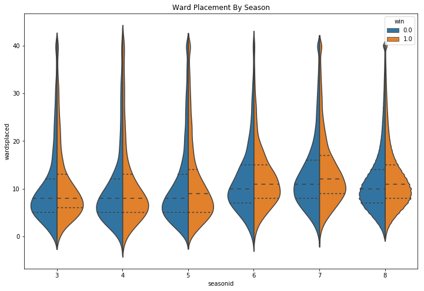


```python
plt.figure(figsize=(12,8))
sns.violinplot(x='adjposition', y='wardsplaced', hue='win', data=dfw, split=True, inner='quartile')
plt.title('Ward Placement By Position')
```


    Text(0.5, 1.0, 'Ward Placement By Position')


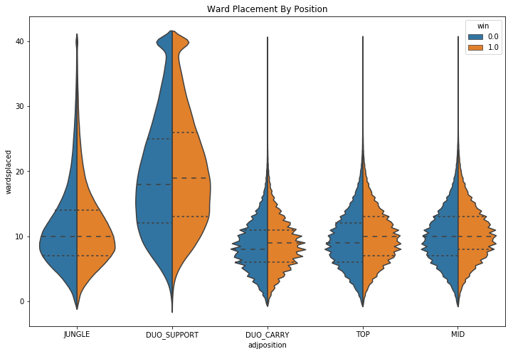


```python
role = ['TOP', 'JUNGLE', 'MID', 'DUO_CARRY', 'DUO_SUPPORT']
d = {}
for r in role:
    d[r] = dfw[dfw.adjposition == r]

for k in d.keys(): 
    plt.figure(figsize=(12,8))
    sns.violinplot(x='seasonid', y='wardsplaced', hue='win', data=d[k], split=True, inner='quartile')
    plt.title('Ward Placement By Season for %s' %k)
```


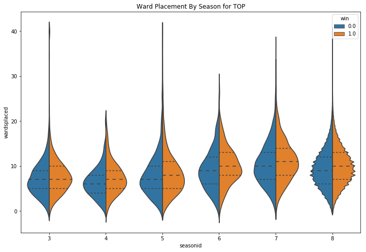


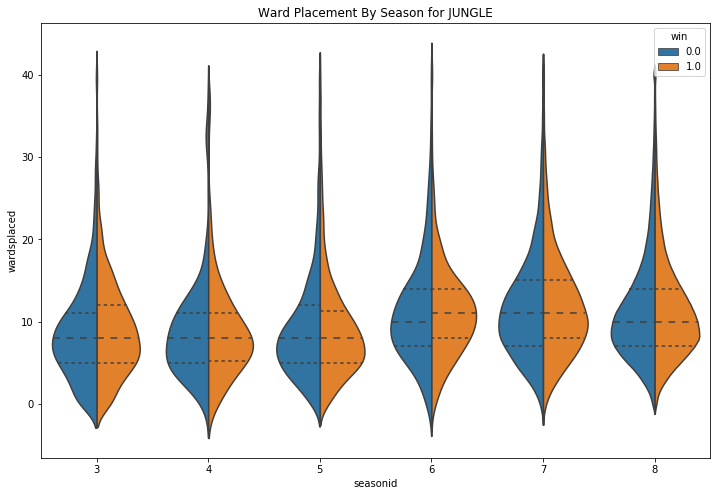


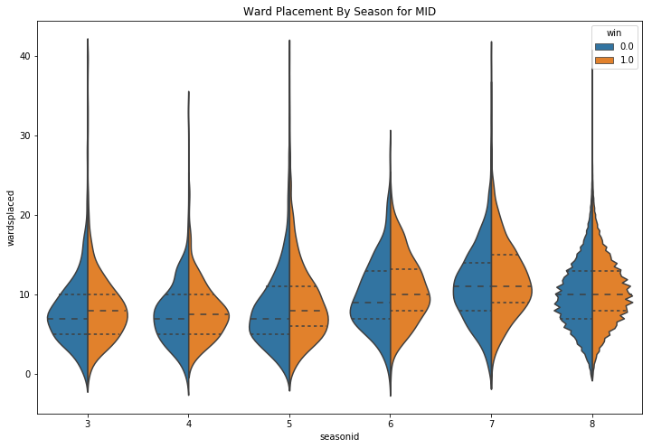


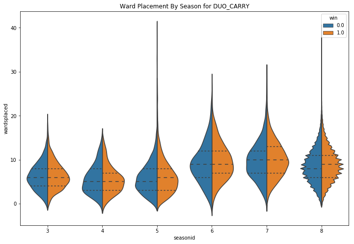


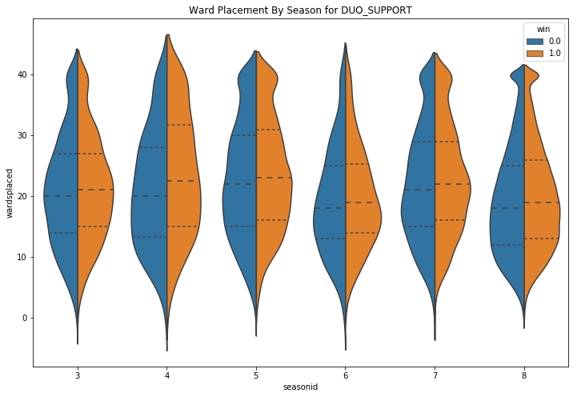


When comparing ward placements over the past 5 seasons, we can see that the overall average amount has increased every season. Also, you can see that the winning team has higher ward placement when compared to the losing team in the more recent seasons. When looking at ward placement by role, you can see that support players place way more wards compared to the other roles. It has become a "meta" of the game for support players to be the one to use their gold to buy wards to provide their teammates vision around the map. It is no suprise to see these trends by role. Based on these violin plots, winning teams tend to place more wards overall.

# Gold spending difference between winning and losing teams

During live professional League of Legends matches, one of the key statistics that can tell a large portion of how the game is going in terms of leads for a teams is a team's gold lead compared to their opoonents. Teams with a large gold lead after a certain amount of time tend to win games more. I was curious on how big of leads gold difference can be for teams that typically decides games. Below, I wanted to see what percent of the total gold spent each game goes towards both teams, and what percent of winning teams have gold advantage at the end of the game.


```python
#gives the percent of winning teams who had a gold advantage at the end of the game
def gold_adv_winners(dframe, team):
    team_gold_adv = len(dframe[(dframe[team+'_Gold_Percent'] > 0.5) & (dframe['Winner'] == team) ])
    team_winners = len(dframe[dframe['Winner'] == team])
    print('Percent of' ,team, 'Winners who had Gold Advantage:', round(team_gold_adv/team_winners*100,2),'%')
    
gold_adv_winners(df_gold, "Blue")
gold_adv_winners(df_gold, "Red")
```

    Percent of Blue Winners who had Gold Advantage: 88.21 %
    Percent of Red Winners who had Gold Advantage: 89.34 %
    


```python
plt.figure(figsize=(12,10))
plt.scatter(x=team_gold_df['win'], y=team_gold_df['Gold_Percent'], alpha = 0.2)
plt.title('Gold Advantage/Disadvantage of Winning and Losing Team')
plt.ylabel('Percent Gold Advantage/Disadvantage')
plt.xlabel('0 = Losers & 1 = Winners')
```


    Text(0.5, 0, '0 = Losers & 1 = Winners')


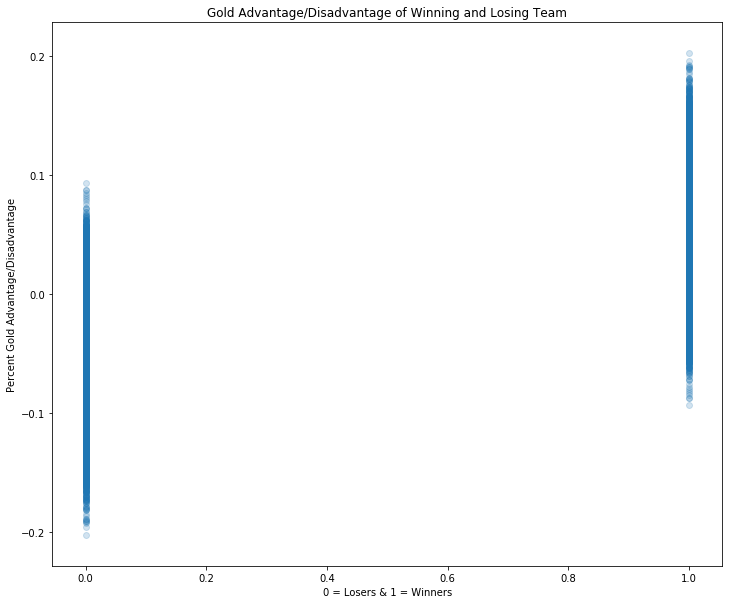


Things I learned going through the gold difference analysis:

1) 89% of winning teams had a total gold advantage at the end of the game.

2) Of those team who don't have gold advantage, the minimum percent of total gold spent by a winning team seems to not go below 40% of total, 

3) teams typically dont acquired over 60% of the total game gold.

# Impact of getting certain game objectives first

There are some objectives, including turrets and inhibitors, that teams can organize in achieving that can provide advantages to winning the game. Below are the list of objectives that teams can get:

1) First blood (player who gets the first kill of the game gets bonus gold)

2) First turret (team who gets the first turret of the game gets bonus gold)

3) First inhibitor

4) First dragon (neutral objective that gives the team a unique bonus stat)

5) First baron (neutral objective that gives the team and their minions a unique bonus stat for a limited time)

I wanted to analyze how important getting some of these objectives first are in achieving victory.


```python
firsts_win_percent(teamstats_wins, b_d_df, "Red", 200)
firsts_win_percent(teamstats_wins, b_d_df, "Blue", 100)
```

    Percent of Red teams that get first blood that win the game: 58.14 %
    Percent of Red teams that get first tower that win the game: 69.92 %
    Percent of Red teams that get first inhib that win the game: 85.54 %
    Percent of Red teams that get first baron that win the game: 82.86 %
    Percent of Red teams that get first dragon that win the game: 68.17 %
    Percent of Blue teams that get first blood that win the game: 60.06 %
    Percent of Blue teams that get first tower that win the game: 72.05 %
    Percent of Blue teams that get first inhib that win the game: 86.39 %
    Percent of Blue teams that get first baron that win the game: 79.41 %
    Percent of Blue teams that get first dragon that win the game: 67.04 %
    


```python
def percent_team_first_obj(team, teamid, objective):
    first_obj_count = len(teamstats_wins[(teamstats_wins['teamid'] == teamid) & (teamstats_wins['first'+objective] == 1)])
    if objective == 'dragon':
        games_with_obj = int(len(b_d_df[(b_d_df.D_Kills > 0)]))
    else:
        games_with_obj = int(len(b_d_df[(b_d_df.B_Kills > 0)]))
    print('Percent of games', team, 'team gets first', objective, ':', round(first_obj_count/games_with_obj*100,2),'%')
```


```python
percent_team_first_obj('Red', 200, 'dragon')
percent_team_first_obj('Red', 200, 'baron')
percent_team_first_obj('Blue', 100, 'dragon')
percent_team_first_obj('Blue', 100, 'baron')
```

    Percent of games Red team gets first dragon : 50.13 %
    Percent of games Red team gets first baron : 52.09 %
    Percent of games Blue team gets first dragon : 49.87 %
    Percent of games Blue team gets first baron : 47.91 %
    

The most important objectives of the game look to be the first baron and first inhibitor, as over 80% of teams who get either first baron or first inhibitor end up winning the game. Typically, these objectives are achieved later in the game, when advantages are already created for teams by achieving tower kills and champion kills.

# Champion Analysis and Matchups

There are currently 130 champions to select to play in league of legends. They all have their unique skills and abilities. Some champions are suited for different roles, some have clear advantages over each other, and some have great synergies with others. Having a way of understanding champions overall effectivness in public games to win games can help analysts great team compositions revolving around the champion's strengths. Also, understanding why certain champions and synergies work well against other champions and synergies can help analysts and players better understand why.

Below are a few analysis I've done revolving around the actual champions of the game:

1) Which champions overall have good win rates in general?

2) Which champions counter specific champions?

3) Which bottom lane synergies have good win rates?

4) Which bottom lane synergies counter other bottom lane synergies?


```python
# takes every champion and calculates their kills, deaths, assists, KDA, and win rate overal, regardless of what role they chose

pd.options.display.float_format = '{:,.1f}'.format

df_win_rate = df.groupby('name').agg({'win': 'sum', 'name': 'count', 'kills': 'mean', 'deaths': 'mean', 'assists': 'mean'})
df_win_rate.columns = ['win matches', 'total matches', 'K', 'D', 'A']
df_win_rate['win rate'] = df_win_rate['win matches'] /  df_win_rate['total matches'] * 100
df_win_rate['KDA'] = (df_win_rate['K'] + df_win_rate['A']) / df_win_rate['D']
df_win_rate = df_win_rate.sort_values('win rate', ascending = False)
df_win_rate = df_win_rate[['win rate', 'K', 'D', 'A', 'KDA']]


print('Top 10 win rate')
print(df_win_rate.head(10))
print('Bottom 5 win rate')
print(df_win_rate.tail(5))
```

    Top 10 win rate
              win rate   K   D    A  KDA
    name                                
    Ivern         55.9 2.6 4.2 13.3  3.8
    Anivia        54.0 6.4 4.8  7.5  2.9
    Xerath        53.6 7.3 5.4  8.6  2.9
    Ahri          53.5 7.3 5.6  7.7  2.7
    Sona          53.1 3.0 5.7 13.9  2.9
    Skarner       53.1 4.8 5.0  9.2  2.8
    Zilean        53.0 3.2 4.7 11.9  3.2
    KogMaw        52.7 7.9 6.6  7.1  2.3
    Janna         52.7 0.9 4.0 14.5  3.8
    Pantheon      52.6 8.1 6.5  6.8  2.3
    Bottom 5 win rate
            win rate   K   D    A  KDA
    name                              
    Rengar      45.7 7.0 6.6  6.4  2.0
    Rakan       45.6 1.5 5.6 14.2  2.8
    Ezreal      45.5 6.7 5.5  8.0  2.7
    Azir        44.1 5.9 6.6  6.6  1.9
    Ryze        38.9 5.4 6.3  6.2  1.9
    


```python
df_matchup = df_match.groupby(['adjposition', 'match up']).agg({'win_adj': 'sum', 'match up': 'count'})
df_matchup.columns = ['win matches', 'total matches']
df_matchup['total matches'] = df_matchup['total matches'] / 2
df_matchup['win rate'] = df_matchup['win matches'] /  df_matchup['total matches']  * 100
df_matchup['score'] = df_matchup['win rate'] - 50
df_matchup['score (ND)'] = abs(df_matchup['score'])
df_matchup = df_matchup[df_matchup['total matches'] > df_matchup['total matches'].sum()*0.0001]

df_matchup = df_matchup.sort_values('score (ND)', ascending = False)
df_matchup = df_matchup[['score']]                   
df_matchup = df_matchup.reset_index()

print('Score +/- means first/second champion dominant:')

for i in df_matchup['adjposition'].unique(): 
        print('\n{}:'.format(i))
        print(df_matchup[df_matchup['adjposition'] == i].iloc[:,1:].head(5))
```

    Score +/- means first/second champion dominant:
    
    MID:
                    match up  score
    0          Annie vs Ryze   25.0
    1           Ahri vs Ryze   21.2
    8            Azir vs Lux  -14.7
    12  Ryze vs Twisted Fate  -14.1
    13          Ekko vs Ryze   13.8
    
    JUNGLE:
                  match up  score
    2   Rengar vs Xin Zhao  -17.5
    4    Evelynn vs Rengar   15.3
    5    Hecarim vs Twitch   15.2
    10     Graves vs Ivern  -14.4
    11          Nunu vs Vi   14.2
    
    TOP:
                   match up  score
    3   Gangplank vs Singed   15.7
    6       Yasuo vs Yorick   15.1
    9         Shen vs Teemo  -14.6
    14      Maokai vs Yasuo  -13.7
    15     Irelia vs Kennen   13.4
    
    DUO_SUPPORT:
                   match up  score
    7   Janna vs Tahm Kench   14.9
    23  Blitzcrank vs Galio   13.1
    37      Leona vs VelKoz   12.1
    61   Tahm Kench vs Zyra  -10.7
    74         Brand vs Lux   10.4
    
    DUO_CARRY:
                  match up  score
    29   Kalista vs KogMaw  -12.6
    72    Ezreal vs Graves  -10.5
    95     Graves vs Vayne   -9.7
    110    Sivir vs Twitch   -9.2
    176   KogMaw vs Twitch   -8.1
    


```python
champion = 'Riven'
role = 'TOP'
get_best_counter(champion, role)
```

    Best counter for TOP - Riven:
          champion  advantage
    294   Xin Zhao        6.5
    773      Jayce        3.5
    980    Trundle        2.6
    1052     Swain        2.4
    1097    Illaoi        2.2
    1127    Irelia        2.1
    1158  Nautilus        2.0
    1203      Kled        1.8
    1214     Kayle        1.8
    1282    Wukong        1.6
    1295  Malphite        1.5
    1418  Renekton        1.1
    1501   DrMundo        0.8
    1651     Teemo        0.3
    

### Bottom lane specific

The bottom lane is unique compared to other lanes in which there are two champions per team, the carry and the support. Below is the same analysis above, but for all bottom lane carries and support combinations.


```python
df_bot_matchup = df_bot.groupby(['matchup']).agg({'win_adj': 'sum', 'matchup': 'count'})
df_bot_matchup.columns = ['win matches', 'total matches']
df_bot_matchup['win matches'] = df_bot_matchup['win matches'] / 2
df_bot_matchup['total matches'] = df_bot_matchup['total matches'] / 4
df_bot_matchup['win rate'] = df_bot_matchup['win matches'] /  df_bot_matchup['total matches']  * 100
df_bot_matchup['score'] = df_bot_matchup['win rate'] - 50
df_bot_matchup['score (ND)'] = abs(df_bot_matchup['score'])
df_bot_matchup = df_bot_matchup[df_bot_matchup['total matches'] > df_bot_matchup['total matches'].sum()*0.0001]

df_bot_matchup = df_bot_matchup.sort_values('score (ND)', ascending = False)
df_bot_matchup = df_bot_matchup[['total matches', 'score']]                   
df_bot_matchup = df_bot_matchup.reset_index()

print('Score +/- means first/second champion dominant:')

for i in df_bot_matchup['matchup'].unique(): 
        print('\n{}:'.format(i))
        print(df_bot_matchup[df_bot_matchup['matchup'] == i].iloc[:,1:].head(5))
```

    Score +/- means first/second champion dominant:
    
    Caitlyn & Morgana vs Ezreal & Thresh:
       total matches  score
    0           20.0   35.0
    
    Lucian & Bard vs Xayah & Thresh:
       total matches  score
    1           19.0   34.2
    
    Xayah & Rakan vs Vayne & Janna:
       total matches  score
    2           16.0  -31.2
    
    Draven & Morgana vs Lucian & Thresh:
       total matches  score
    3           15.0   30.0
    
    Vayne & Janna vs Lucian & Sona:
       total matches  score
    4           15.0   30.0
    
    Miss Fortune & Nami vs Lucian & Thresh:
       total matches  score
    5           15.0  -30.0
    
    Caitlyn & Karma vs Lucian & Blitzcrank:
       total matches  score
    6           15.0  -30.0
    
    Lucian & Thresh vs KogMaw & Lulu:
       total matches  score
    7           15.0  -30.0
    
    Caitlyn & Janna vs Vayne & Thresh:
       total matches  score
    8           20.0   30.0
    
    Lucian & Soraka vs Vayne & Thresh:
       total matches  score
    9           19.0  -28.9
    
    Draven & Thresh vs Caitlyn & Blitzcrank:
        total matches  score
    10           19.0   28.9
    
    Caitlyn & Janna vs Lucian & Rakan:
        total matches  score
    11           19.0   28.9
    
    Jinx & Blitzcrank vs Caitlyn & Thresh:
        total matches  score
    12           23.0   28.3
    
    Caitlyn & Thresh vs Ashe & Lulu:
        total matches  score
    13           23.0   28.3
    
    Lucian & Alistar vs Caitlyn & Thresh:
        total matches  score
    14           18.0  -27.8
    
    Lucian & Blitzcrank vs Caitlyn & Janna:
        total matches  score
    15           18.0  -27.8
    
    Jinx & Thresh vs Lucian & Leona:
        total matches  score
    16           22.0   27.3
    
    Caitlyn & Thresh vs Xayah & Janna:
        total matches  score
    17           22.0   27.3
    
    Caitlyn & Bard vs Lucian & Braum:
        total matches  score
    18           17.0   26.5
    
    Lucian & Braum vs Caitlyn & Blitzcrank:
        total matches  score
    19           21.0   26.2
    
    Ezreal & Karma vs Lucian & Thresh:
        total matches  score
    20           25.0   26.0
    
    Caitlyn & Lulu vs Ashe & Karma:
        total matches  score
    21           16.0   25.0
    
    Ashe & Thresh vs Caitlyn & Nami:
        total matches  score
    22           16.0  -25.0
    
    Ezreal & Thresh vs Caitlyn & Blitzcrank:
        total matches  score
    23           24.0  -25.0
    
    Ezreal & Thresh vs Lucian & Nami:
        total matches  score
    24           16.0  -25.0
    
    Caitlyn & Karma vs Vayne & Janna:
        total matches  score
    25           16.0   25.0
    
    Caitlyn & Morgana vs Lucian & Blitzcrank:
        total matches  score
    26           24.0   25.0
    
    Vayne & Nami vs Lucian & Braum:
        total matches  score
    27           16.0  -25.0
    
    Lucian & Nami vs Draven & Thresh:
        total matches  score
    28           16.0  -25.0
    
    Jinx & Karma vs Lucian & Thresh:
        total matches  score
    29           16.0   25.0
    
    Caitlyn & Morgana vs Xayah & Rakan:
        total matches  score
    30           27.0   24.1
    
    Xayah & Rakan vs Jhin & Thresh:
        total matches  score
    31           19.0  -23.7
    
    Lucian & Karma vs Ashe & Thresh:
        total matches  score
    32           15.0  -23.3
    
    Xayah & Thresh vs Vayne & Janna:
        total matches  score
    33           15.0  -23.3
    
    Lucian & Brand vs Xayah & Rakan:
        total matches  score
    34           15.0  -23.3
    
    Lucian & Rakan vs Caitlyn & Blitzcrank:
        total matches  score
    35           15.0   23.3
    
    Draven & Bard vs Lucian & Thresh:
        total matches  score
    36           15.0   23.3
    
    Caitlyn & Leona vs Ashe & Thresh:
        total matches  score
    37           15.0   23.3
    
    KogMaw & Janna vs Lucian & Thresh:
        total matches  score
    38           15.0   23.3
    
    Ezreal & Janna vs Caitlyn & Thresh:
        total matches  score
    39           15.0   23.3
    
    Xayah & Morgana vs Lucian & Braum:
        total matches  score
    40           15.0   23.3
    
    Lucian & Lulu vs Vayne & Thresh:
        total matches  score
    41           22.0   22.7
    
    Vayne & Janna vs Draven & Thresh:
        total matches  score
    42           22.0  -22.7
    
    Xayah & Thresh vs Lucian & Rakan:
        total matches  score
    43           22.0  -22.7
    
    Xayah & Thresh vs Caitlyn & Blitzcrank:
        total matches  score
    44           18.0  -22.2
    
    Caitlyn & Thresh vs Vayne & Nami:
        total matches  score
    45           18.0   22.2
    
    Lucian & Thresh vs Jinx & Lulu:
        total matches  score
    46           18.0   22.2
    
    Lucian & Thresh vs Vayne & Janna:
        total matches  score
    47           53.0  -21.7
    
    Caitlyn & Bard vs Lucian & Janna:
        total matches  score
    48           28.0   21.4
    
    Lucian & Blitzcrank vs Caitlyn & Morgana:
        total matches  score
    49           24.0   20.8
    
    Lucian & Rakan vs Vayne & Thresh:
        total matches  score
    50           24.0  -20.8
    
    Caitlyn & Nami vs Lucian & Janna:
        total matches  score
    51           24.0  -20.8
    
    Caitlyn & Morgana vs Lucian & Braum:
        total matches  score
    52           17.0   20.6
    
    Lucian & Leona vs Ezreal & Thresh:
        total matches  score
    53           17.0   20.6
    
    Caitlyn & Morgana vs Jhin & Thresh:
        total matches  score
    54           17.0   20.6
    
    Lucian & Nami vs Jinx & Thresh:
        total matches  score
    55           17.0   20.6
    
    Caitlyn & Janna vs Lucian & Soraka:
        total matches  score
    56           17.0  -20.6
    
    Caitlyn & Nami vs Lucian & Lulu:
        total matches  score
    57           17.0  -20.6
    
    Xayah & Rakan vs Lucian & Bard:
        total matches  score
    58           17.0  -20.6
    
    Caitlyn & Morgana vs Vayne & Thresh:
        total matches  score
    59           20.0   20.0
    
    Xayah & Rakan vs Lucian & Lulu:
        total matches  score
    60           20.0  -20.0
    
    Ezreal & Thresh vs Caitlyn & Janna:
        total matches  score
    61           30.0  -20.0
    
    Ezreal & Rakan vs Lucian & Thresh:
        total matches  score
    62           23.0  -19.6
    
    Vayne & Blitzcrank vs Caitlyn & Thresh:
        total matches  score
    63           23.0   19.6
    
    Lucian & Blitzcrank vs Xayah & Rakan:
        total matches  score
    64           26.0  -19.2
    
    Caitlyn & Thresh vs Lucian & Morgana:
        total matches  score
    65           42.0   19.0
    
    Ashe & Nami vs Lucian & Thresh:
        total matches  score
    66           16.0   18.8
    
    Caitlyn & Morgana vs Vayne & Janna:
        total matches  score
    67           16.0   18.8
    
    Lucian & Thresh vs Jinx & Rakan:
        total matches  score
    68           16.0   18.8
    
    Lucian & Alistar vs Vayne & Thresh:
        total matches  score
    69           16.0  -18.8
    
    Caitlyn & Karma vs Lucian & Lulu:
        total matches  score
    70           16.0   18.8
    
    Lucian & Bard vs Caitlyn & Rakan:
        total matches  score
    71           16.0   18.8
    
    Caitlyn & Rakan vs Lucian & Lulu:
        total matches  score
    72           16.0  -18.8
    
    Lucian & Janna vs Vayne & Karma:
        total matches  score
    73           16.0   18.8
    
    Caitlyn & Thresh vs Ezreal & Rakan:
        total matches  score
    74           16.0   18.8
    
    Vayne & Janna vs Jinx & Thresh:
        total matches  score
    75           16.0   18.8
    
    Lucian & Thresh vs Xayah & Morgana:
        total matches  score
    76           16.0   18.8
    
    Caitlyn & Thresh vs Draven & Janna:
        total matches  score
    77           32.0   18.8
    
    Jinx & Janna vs Caitlyn & Thresh:
        total matches  score
    78           35.0   18.6
    
    Lucian & Thresh vs Jinx & Morgana:
        total matches  score
    79           19.0  -18.4
    
    Ashe & Karma vs Caitlyn & Thresh:
        total matches  score
    80           19.0  -18.4
    
    Lucian & Janna vs Caitlyn & Morgana:
        total matches  score
    81           19.0  -18.4
    
    Caitlyn & Karma vs Lucian & Bard:
        total matches  score
    82           19.0   18.4
    
    Lucian & Braum vs Ashe & Thresh:
        total matches  score
    83           19.0   18.4
    
    Lucian & Braum vs Caitlyn & Nami:
        total matches  score
    84           22.0  -18.2
    
    Xayah & Rakan vs Vayne & Soraka:
        total matches  score
    85           22.0  -18.2
    
    Lucian & Blitzcrank vs Caitlyn & Lulu:
        total matches  score
    86           22.0   18.2
    
    Draven & Janna vs Lucian & Thresh:
        total matches  score
    87           22.0   18.2
    
    Vayne & Morgana vs Caitlyn & Thresh:
        total matches  score
    88           25.0  -18.0
    
    Lucian & Thresh vs Ezreal & Bard:
        total matches  score
    89           25.0   18.0
    
    Caitlyn & Thresh vs Lucian & Soraka:
        total matches  score
    90           28.0  -17.9
    
    Caitlyn & Thresh vs Jinx & Lulu:
        total matches  score
    91           31.0  -17.7
    
    Tristana & Thresh vs Caitlyn & Morgana:
        total matches  score
    92           15.0  -16.7
    
    Caitlyn & Rakan vs Vayne & Thresh:
        total matches  score
    93           18.0  -16.7
    
    Xayah & Karma vs Lucian & Lulu:
        total matches  score
    94           15.0  -16.7
    
    Lucian & Zyra vs Caitlyn & Thresh:
        total matches  score
    95           21.0  -16.7
    
    Ezreal & Nami vs Lucian & Thresh:
        total matches  score
    96           18.0  -16.7
    
    Lucian & Thresh vs Xayah & Lulu:
        total matches  score
    97           15.0  -16.7
    
    Ezreal & Thresh vs Vayne & Janna:
        total matches  score
    98           18.0  -16.7
    
    Jinx & Lulu vs Caitlyn & Thresh:
        total matches  score
    99           30.0  -16.7
    
    Lucian & Karma vs Caitlyn & Blitzcrank:
         total matches  score
    100           15.0  -16.7
    
    Vayne & Thresh vs Lucian & Nami:
         total matches  score
    101           21.0  -16.7
    
    Lucian & Karma vs Caitlyn & Lulu:
         total matches  score
    102           18.0  -16.7
    
    Lucian & Braum vs KogMaw & Lulu:
         total matches  score
    103           15.0  -16.7
    
    Draven & Blitzcrank vs Caitlyn & Thresh:
         total matches  score
    104           15.0  -16.7
    
    Caitlyn & Thresh vs Lucian & Maokai:
         total matches  score
    105           15.0  -16.7
    
    Lucian & Janna vs Ashe & Thresh:
         total matches  score
    106           15.0  -16.7
    
    Lucian & Braum vs Caitlyn & Lulu:
         total matches  score
    107           18.0   16.7
    
    Lucian & Janna vs Caitlyn & Nami:
         total matches  score
    108           21.0   16.7
    
    Ezreal & Leona vs Lucian & Thresh:
         total matches  score
    109           18.0   16.7
    
    Lucian & Lulu vs Caitlyn & Rakan:
         total matches  score
    110           15.0   16.7
    
    Caitlyn & Thresh vs Ashe & Janna:
         total matches  score
    111           18.0   16.7
    
    Lucian & Lulu vs Caitlyn & Blitzcrank:
         total matches  score
    112           15.0   16.7
    
    Caitlyn & Thresh vs Jhin & Janna:
         total matches  score
    113           15.0   16.7
    
    Kalista & Thresh vs Lucian & Braum:
         total matches  score
    114           18.0   16.7
    
    Lucian & Thresh vs Xayah & Blitzcrank:
         total matches  score
    115           21.0   16.7
    
    Vayne & Thresh vs Ezreal & Janna:
         total matches  score
    116           18.0   16.7
    
    Lucian & Thresh vs Twitch & Janna:
         total matches  score
    117           15.0   16.7
    
    Lucian & Thresh vs Ezreal & Leona:
         total matches  score
    118           15.0   16.7
    
    Draven & Blitzcrank vs Caitlyn & Leona:
         total matches  score
    119           15.0   16.7
    
    Vayne & Karma vs Lucian & Janna:
         total matches  score
    120           15.0   16.7
    
    Jinx & Thresh vs Caitlyn & Nami:
         total matches  score
    121           21.0   16.7
    
    Ashe & Leona vs Caitlyn & Thresh:
         total matches  score
    122           15.0   16.7
    
    Draven & Thresh vs Caitlyn & Karma:
         total matches  score
    123           33.0   16.7
    
    Ashe & Janna vs Caitlyn & Thresh:
         total matches  score
    124           24.0   16.7
    
    Ezreal & Thresh vs Lucian & Karma:
         total matches  score
    125           32.0  -15.6
    
    Lucian & Thresh vs Caitlyn & Zyra:
         total matches  score
    126           29.0   15.5
    
    Vayne & Thresh vs Caitlyn & Karma:
         total matches  score
    127           26.0   15.4
    
    Vayne & Thresh vs Lucian & Karma:
         total matches  score
    128           26.0  -15.4
    
    Ashe & Thresh vs Xayah & Rakan:
         total matches  score
    129           26.0   15.4
    
    Ezreal & Thresh vs Xayah & Rakan:
         total matches  score
    130           23.0   15.2
    
    Lucian & Janna vs Caitlyn & Rakan:
         total matches  score
    131           23.0   15.2
    
    Lucian & Braum vs Jinx & Thresh:
         total matches  score
    132           23.0  -15.2
    
    Vayne & Janna vs Xayah & Thresh:
         total matches  score
    133           20.0  -15.0
    
    Lucian & Janna vs Caitlyn & Blitzcrank:
         total matches  score
    134           20.0   15.0
    
    Lucian & Blitzcrank vs Ezreal & Thresh:
         total matches  score
    135           20.0   15.0
    
    Lucian & Janna vs Caitlyn & Soraka:
         total matches  score
    136           20.0  -15.0
    
    Lucian & Thresh vs Ashe & Lulu:
         total matches  score
    137           20.0  -15.0
    
    Vayne & Karma vs Xayah & Rakan:
         total matches  score
    138           20.0   15.0
    
    Jinx & Thresh vs Vayne & Leona:
         total matches  score
    139           17.0  -14.7
    
    Caitlyn & Braum vs Lucian & Janna:
         total matches  score
    140           17.0  -14.7
    
    Ezreal & Nami vs Caitlyn & Thresh:
         total matches  score
    141           17.0  -14.7
    
    Lucian & Nautilus vs Caitlyn & Thresh:
         total matches  score
    142           17.0   14.7
    
    Vayne & Janna vs Lucian & Karma:
         total matches  score
    143           17.0  -14.7
    
    Twitch & Thresh vs Caitlyn & Janna:
         total matches  score
    144           17.0   14.7
    
    Lucian & Rakan vs Caitlyn & Morgana:
         total matches  score
    145           17.0   14.7
    
    Jinx & Janna vs Ezreal & Thresh:
         total matches  score
    146           17.0   14.7
    
    Lucian & Karma vs Caitlyn & Rakan:
         total matches  score
    147           17.0   14.7
    
    Caitlyn & Leona vs Lucian & Braum:
         total matches  score
    148           17.0   14.7
    
    Lucian & Thresh vs Ezreal & Blitzcrank:
         total matches  score
    149           17.0  -14.7
    
    Lucian & Thresh vs Ezreal & Lulu:
         total matches  score
    150           17.0   14.7
    
    Caitlyn & Thresh vs Ezreal & Sona:
         total matches  score
    151           17.0  -14.7
    
    Caitlyn & Lulu vs Lucian & Thresh:
         total matches  score
    152           48.0  -14.6
    
    Caitlyn & Bard vs Xayah & Rakan:
         total matches  score
    153           28.0   14.3
    
    Xayah & Thresh vs Caitlyn & Janna:
         total matches  score
    154           28.0  -14.3
    
    Caitlyn & Janna vs Ezreal & Thresh:
         total matches  score
    155           25.0   14.0
    
    Caitlyn & Karma vs Lucian & Thresh:
         total matches  score
    156           61.0   13.9
    
    Caitlyn & Janna vs Xayah & Rakan:
         total matches  score
    157           47.0   13.8
    
    Ezreal & Morgana vs Caitlyn & Thresh:
         total matches  score
    158           22.0   13.6
    
    Caitlyn & Lulu vs Vayne & Thresh:
         total matches  score
    159           22.0   13.6
    
    Lucian & Janna vs Xayah & Rakan:
         total matches  score
    160           33.0   13.6
    
    Caitlyn & Leona vs Lucian & Thresh:
         total matches  score
    161           30.0  -13.3
    
    Xayah & Thresh vs Caitlyn & Rakan:
         total matches  score
    162           30.0   13.3
    
    Lucian & Thresh vs Caitlyn & Soraka:
         total matches  score
    163           30.0   13.3
    
    Ashe & Thresh vs Lucian & Braum:
         total matches  score
    164           19.0  -13.2
    
    Caitlyn & Nami vs Vayne & Thresh:
         total matches  score
    165           19.0  -13.2
    
    Ashe & Thresh vs Lucian & Janna:
         total matches  score
    166           19.0  -13.2
    
    Lucian & Karma vs Jinx & Thresh:
         total matches  score
    167           19.0  -13.2
    
    Lucian & Janna vs Vayne & Nami:
         total matches  score
    168           19.0  -13.2
    
    Ezreal & Janna vs Lucian & Thresh:
         total matches  score
    169           19.0   13.2
    
    Caitlyn & Blitzcrank vs Lucian & Soraka:
         total matches  score
    170           19.0   13.2
    
    Xayah & Rakan vs Twitch & Thresh:
         total matches  score
    171           19.0   13.2
    
    Ashe & Janna vs Lucian & Thresh:
         total matches  score
    172           19.0   13.2
    
    Lucian & Karma vs Ezreal & Thresh:
         total matches  score
    173           19.0   13.2
    
    Jinx & Morgana vs Caitlyn & Thresh:
         total matches  score
    174           19.0   13.2
    
    Caitlyn & Zyra vs Xayah & Rakan:
         total matches  score
    175           19.0   13.2
    
    Lucian & Lulu vs Caitlyn & Thresh:
         total matches  score
    176           46.0  -13.0
    
    Caitlyn & Lulu vs Lucian & Karma:
         total matches  score
    177           27.0   13.0
    
    Caitlyn & Soraka vs Lucian & Thresh:
         total matches  score
    178           27.0   13.0
    
    Lucian & Braum vs Caitlyn & Thresh:
         total matches  score
    179           54.0  -13.0
    
    Caitlyn & Janna vs Lucian & Lulu:
         total matches  score
    180           27.0   13.0
    
    Caitlyn & Karma vs Ashe & Lulu:
         total matches  score
    181           16.0  -12.5
    
    Jinx & Lulu vs Caitlyn & Nami:
         total matches  score
    182           16.0  -12.5
    
    Jinx & Soraka vs Lucian & Thresh:
         total matches  score
    183           16.0  -12.5
    
    Vayne & Alistar vs Caitlyn & Thresh:
         total matches  score
    184           16.0   12.5
    
    Lucian & Nami vs Caitlyn & Morgana:
         total matches  score
    185           16.0  -12.5
    
    Jinx & Thresh vs Vayne & Janna:
         total matches  score
    186           16.0   12.5
    
    Xayah & Blitzcrank vs Caitlyn & Morgana:
         total matches  score
    187           16.0   12.5
    
    Caitlyn & Soraka vs Lucian & Nami:
         total matches  score
    188           16.0  -12.5
    
    Draven & Thresh vs Caitlyn & Bard:
         total matches  score
    189           16.0   12.5
    
    Vayne & Thresh vs Caitlyn & Braum:
         total matches  score
    190           16.0   12.5
    
    Vayne & Thresh vs Jinx & Janna:
         total matches  score
    191           16.0  -12.5
    
    Xayah & Karma vs Caitlyn & Janna:
         total matches  score
    192           16.0  -12.5
    
    Ashe & Thresh vs Caitlyn & Morgana:
         total matches  score
    193           16.0  -12.5
    
    Caitlyn & Sona vs Xayah & Rakan:
         total matches  score
    194           24.0   12.5
    
    KogMaw & Lulu vs Lucian & Thresh:
         total matches  score
    195           24.0   12.5
    
    Caitlyn & Thresh vs Draven & Nami:
         total matches  score
    196           16.0   12.5
    
    Lucian & Morgana vs Caitlyn & Leona:
         total matches  score
    197           16.0  -12.5
    
    Caitlyn & Thresh vs Draven & Karma:
         total matches  score
    198           16.0   12.5
    
    Caitlyn & Thresh vs Draven & Blitzcrank:
         total matches  score
    199           16.0   12.5
    
    Caitlyn & Morgana vs Jinx & Leona:
         total matches  score
    200           16.0   12.5
    
    Lucian & Janna vs Vayne & Thresh:
         total matches  score
    201           32.0   12.5
    
    Lucian & Nami vs Caitlyn & Blitzcrank:
         total matches  score
    202           16.0   12.5
    
    Xayah & Rakan vs Vayne & Lulu:
         total matches  score
    203           29.0   12.1
    
    Xayah & Rakan vs Caitlyn & Braum:
         total matches  score
    204           21.0  -11.9
    
    Ezreal & Thresh vs Lucian & Leona:
         total matches  score
    205           21.0  -11.9
    
    Jinx & Leona vs Vayne & Thresh:
         total matches  score
    206           21.0  -11.9
    
    Lucian & Morgana vs Xayah & Rakan:
         total matches  score
    207           21.0   11.9
    
    Caitlyn & Thresh vs Vayne & Karma:
         total matches  score
    208           21.0   11.9
    
    Caitlyn & Nami vs Lucian & Karma:
         total matches  score
    209           34.0   11.8
    
    Caitlyn & Rakan vs Lucian & Thresh:
         total matches  score
    210           34.0  -11.8
    
    Caitlyn & Thresh vs Lucian & Janna:
         total matches  score
    211           47.0   11.7
    
    Caitlyn & Sona vs Lucian & Thresh:
         total matches  score
    212           26.0   11.5
    
    Caitlyn & Janna vs Lucian & Blitzcrank:
         total matches  score
    213           26.0   11.5
    
    Caitlyn & Nami vs Xayah & Rakan:
         total matches  score
    214           26.0   11.5
    
    Xayah & Rakan vs Caitlyn & Nami:
         total matches  score
    215           31.0  -11.3
    
    Caitlyn & Morgana vs Jinx & Thresh:
         total matches  score
    216           31.0   11.3
    
    Caitlyn & Zyra vs Lucian & Thresh:
         total matches  score
    217           31.0  -11.3
    
    Ashe & Lulu vs Caitlyn & Thresh:
         total matches  score
    218           18.0   11.1
    
    Jinx & Lulu vs Xayah & Rakan:
         total matches  score
    219           18.0   11.1
    
    Vayne & Sona vs Xayah & Rakan:
         total matches  score
    220           18.0   11.1
    
    Lucian & Morgana vs Caitlyn & Blitzcrank:
         total matches  score
    221           18.0   11.1
    
    Twitch & Janna vs Caitlyn & Thresh:
         total matches  score
    222           18.0   11.1
    
    Lucian & Janna vs Ezreal & Thresh:
         total matches  score
    223           18.0   11.1
    
    Caitlyn & Nami vs Draven & Janna:
         total matches  score
    224           18.0  -11.1
    
    Vayne & Thresh vs Lucian & Leona:
         total matches  score
    225           18.0  -11.1
    
    Vayne & Janna vs Caitlyn & Karma:
         total matches  score
    226           18.0  -11.1
    
    Vayne & Thresh vs Jinx & Blitzcrank:
         total matches  score
    227           18.0  -11.1
    
    Vayne & Janna vs Caitlyn & Nami:
         total matches  score
    228           18.0  -11.1
    
    Lucian & Nami vs Caitlyn & Karma:
         total matches  score
    229           23.0   10.9
    
    Lucian & Leona vs Caitlyn & Thresh:
         total matches  score
    230           23.0   10.9
    
    Lucian & Nami vs Caitlyn & Rakan:
         total matches  score
    231           23.0   10.9
    
    Vayne & Thresh vs Caitlyn & Blitzcrank:
         total matches  score
    232           23.0  -10.9
    
    Lucian & Braum vs Ezreal & Thresh:
         total matches  score
    233           28.0  -10.7
    
    Lucian & Thresh vs Caitlyn & Leona:
         total matches  score
    234           28.0  -10.7
    
    Caitlyn & Blitzcrank vs Vayne & Thresh:
         total matches  score
    235           28.0   10.7
    
    Caitlyn & Thresh vs Vayne & Blitzcrank:
         total matches  score
    236           28.0   10.7
    
    Xayah & Rakan vs Lucian & Nami:
         total matches  score
    237           28.0   10.7
    
    Lucian & Sona vs Caitlyn & Thresh:
         total matches  score
    238           25.0  -10.0
    
    Ezreal & Morgana vs Lucian & Thresh:
         total matches  score
    239           20.0  -10.0
    
    Lucian & Alistar vs Xayah & Rakan:
         total matches  score
    240           15.0  -10.0
    
    Lucian & Rakan vs Xayah & Thresh:
         total matches  score
    241           30.0  -10.0
    
    Vayne & Janna vs Ashe & Thresh:
         total matches  score
    242           15.0  -10.0
    
    Xayah & Rakan vs Caitlyn & Karma:
         total matches  score
    243           40.0  -10.0
    
    Vayne & Thresh vs Lucian & Blitzcrank:
         total matches  score
    244           25.0   10.0
    
    Lucian & Braum vs Caitlyn & Janna:
         total matches  score
    245           30.0   10.0
    
    Lucian & Thresh vs Jinx & Braum:
         total matches  score
    246           15.0  -10.0
    
    Ezreal & Thresh vs Lucian & Braum:
         total matches  score
    247           30.0  -10.0
    
    Lucian & Thresh vs Ezreal & Karma:
         total matches  score
    248           20.0   10.0
    
    Tristana & Morgana vs Caitlyn & Thresh:
         total matches  score
    249           15.0  -10.0
    
    Lucian & Braum vs Ezreal & Karma:
         total matches  score
    250           15.0   10.0
    
    Lucian & Thresh vs Vayne & Lulu:
         total matches  score
    251           30.0   10.0
    
    Jinx & Blitzcrank vs Caitlyn & Morgana:
         total matches  score
    252           15.0   10.0
    
    Lucian & Lulu vs Xayah & Thresh:
         total matches  score
    253           15.0   10.0
    
    Vayne & Lulu vs Caitlyn & Janna:
         total matches  score
    254           20.0  -10.0
    
    Lucian & Thresh vs Jinx & Karma:
         total matches  score
    255           15.0   10.0
    
    Lucian & Janna vs Xayah & Thresh:
         total matches  score
    256           20.0  -10.0
    
    Lucian & Thresh vs Jinx & Janna:
         total matches  score
    257           15.0  -10.0
    
    Ezreal & Thresh vs Lucian & Janna:
         total matches  score
    258           20.0  -10.0
    
    Ashe & Blitzcrank vs Caitlyn & Thresh:
         total matches  score
    259           15.0   10.0
    
    Caitlyn & Thresh vs Xayah & Leona:
         total matches  score
    260           15.0  -10.0
    
    Caitlyn & Zyra vs Lucian & Blitzcrank:
         total matches  score
    261           15.0  -10.0
    
    Draven & Nami vs Lucian & Thresh:
         total matches  score
    262           15.0  -10.0
    
    Caitlyn & Blitzcrank vs Ashe & Morgana:
         total matches  score
    263           15.0   10.0
    
    Caitlyn & Sona vs Lucian & Karma:
         total matches  score
    264           15.0  -10.0
    
    Caitlyn & Rakan vs Draven & Thresh:
         total matches  score
    265           15.0  -10.0
    
    Xayah & Rakan vs Lucian & Zyra:
         total matches  score
    266           20.0  -10.0
    
    Caitlyn & Braum vs Vayne & Thresh:
         total matches  score
    267           15.0   10.0
    
    Draven & Thresh vs Lucian & Braum:
         total matches  score
    268           15.0   10.0
    
    Caitlyn & Nami vs Twitch & Janna:
         total matches  score
    269           15.0  -10.0
    
    Caitlyn & Janna vs Vayne & Karma:
         total matches  score
    270           15.0  -10.0
    
    Ashe & Thresh vs Caitlyn & Braum:
         total matches  score
    271           15.0  -10.0
    
    Caitlyn & Nami vs Jinx & Thresh:
         total matches  score
    272           15.0  -10.0
    
    Caitlyn & Blitzcrank vs Xayah & Thresh:
         total matches  score
    273           25.0  -10.0
    
    Caitlyn & Nami vs Ezreal & Karma:
         total matches  score
    274           15.0  -10.0
    
    Xayah & Thresh vs Lucian & Bard:
         total matches  score
    275           15.0   10.0
    
    Caitlyn & Blitzcrank vs Lucian & Lulu:
         total matches  score
    276           15.0   10.0
    
    Caitlyn & Thresh vs Xayah & Karma:
         total matches  score
    277           20.0  -10.0
    
    Caitlyn & Blitzcrank vs Lucian & Karma:
         total matches  score
    278           15.0  -10.0
    
    Caitlyn & Thresh vs Twitch & Janna:
         total matches  score
    279           20.0  -10.0
    
    Caitlyn & Karma vs Twitch & Thresh:
         total matches  score
    280           15.0   10.0
    
    Caitlyn & Lulu vs Lucian & Blitzcrank:
         total matches  score
    281           20.0   10.0
    
    Caitlyn & Lulu vs Lucian & Nami:
         total matches  score
    282           25.0  -10.0
    
    Caitlyn & Morgana vs Draven & Thresh:
         total matches  score
    283           20.0   10.0
    
    Caitlyn & Thresh vs Xayah & Soraka:
         total matches  score
    284           15.0   10.0
    
    Caitlyn & Morgana vs Jinx & Lulu:
         total matches  score
    285           15.0   10.0
    
    Caitlyn & Janna vs Ezreal & Karma:
         total matches  score
    286           20.0   10.0
    
    Lucian & Thresh vs Caitlyn & Morgana:
         total matches  score
    287           57.0   -9.6
    
    Lucian & Janna vs Caitlyn & Karma:
         total matches  score
    288           37.0    9.5
    
    Caitlyn & Thresh vs Lucian & Leona:
         total matches  score
    289           32.0   -9.4
    
    Vayne & Soraka vs Lucian & Thresh:
         total matches  score
    290           27.0    9.3
    
    Vayne & Janna vs Xayah & Rakan:
         total matches  score
    291           22.0    9.1
    
    Caitlyn & Thresh vs Jinx & Morgana:
         total matches  score
    292           22.0    9.1
    
    Xayah & Rakan vs Caitlyn & Leona:
         total matches  score
    293           22.0    9.1
    
    Xayah & Karma vs Lucian & Thresh:
         total matches  score
    294           22.0    9.1
    
    Lucian & Karma vs Caitlyn & Morgana:
         total matches  score
    295           22.0    9.1
    
    Xayah & Rakan vs Lucian & Soraka:
         total matches  score
    296           22.0    9.1
    
    Draven & Thresh vs Caitlyn & Janna:
         total matches  score
    297           22.0   -9.1
    
    Ashe & Lulu vs Lucian & Thresh:
         total matches  score
    298           22.0   -9.1
    
    Lucian & Braum vs Xayah & Thresh:
         total matches  score
    299           22.0   -9.1
    
    Caitlyn & Thresh vs Lucian & Karma:
         total matches  score
    300           61.0    9.0
    
    Xayah & Rakan vs Caitlyn & Lulu:
         total matches  score
    301           39.0   -9.0
    
    Lucian & Janna vs Caitlyn & Thresh:
         total matches  score
    302           56.0   -8.9
    
    Lucian & Lulu vs Caitlyn & Nami:
         total matches  score
    303           17.0   -8.8
    
    Jinx & Thresh vs Lucian & Braum:
         total matches  score
    304           17.0   -8.8
    
    Lucian & Lulu vs Draven & Thresh:
         total matches  score
    305           17.0   -8.8
    
    Lucian & Blitzcrank vs Ezreal & Janna:
         total matches  score
    306           17.0   -8.8
    
    Caitlyn & Karma vs Jinx & Thresh:
         total matches  score
    307           17.0   -8.8
    
    Caitlyn & Maokai vs Lucian & Thresh:
         total matches  score
    308           17.0    8.8
    
    Ashe & Blitzcrank vs Lucian & Thresh:
         total matches  score
    309           17.0    8.8
    
    Caitlyn & Thresh vs Jinx & Leona:
         total matches  score
    310           17.0    8.8
    
    Caitlyn & Leona vs Xayah & Rakan:
         total matches  score
    311           17.0    8.8
    
    Lucian & Thresh vs Caitlyn & Alistar:
         total matches  score
    312           17.0   -8.8
    
    Lucian & Blitzcrank vs Vayne & Thresh:
         total matches  score
    313           17.0   -8.8
    
    Ezreal & Karma vs Xayah & Rakan:
         total matches  score
    314           17.0    8.8
    
    Draven & Thresh vs Caitlyn & Braum:
         total matches  score
    315           17.0    8.8
    
    Draven & Thresh vs Lucian & Janna:
         total matches  score
    316           17.0   -8.8
    
    Ezreal & Blitzcrank vs Lucian & Thresh:
         total matches  score
    317           29.0   -8.6
    
    Caitlyn & Janna vs Lucian & Leona:
         total matches  score
    318           24.0    8.3
    
    Vayne & Thresh vs Xayah & Rakan:
         total matches  score
    319           36.0    8.3
    
    Caitlyn & Blitzcrank vs Ezreal & Thresh:
         total matches  score
    320           24.0    8.3
    
    Lucian & Braum vs Caitlyn & Karma:
         total matches  score
    321           24.0   -8.3
    
    Caitlyn & Thresh vs KogMaw & Lulu:
         total matches  score
    322           24.0   -8.3
    
    Lucian & Rakan vs Caitlyn & Thresh:
         total matches  score
    323           36.0   -8.3
    
    Caitlyn & Karma vs Xayah & Thresh:
         total matches  score
    324           31.0    8.1
    
    Caitlyn & Karma vs Lucian & Nami:
         total matches  score
    325           31.0   -8.1
    
    Draven & Thresh vs Lucian & Bard:
         total matches  score
    326           19.0    7.9
    
    Caitlyn & Thresh vs Ezreal & Nami:
         total matches  score
    327           19.0    7.9
    
    Lucian & Blitzcrank vs Caitlyn & Karma:
         total matches  score
    328           19.0    7.9
    
    Caitlyn & Janna vs Jinx & Lulu:
         total matches  score
    329           19.0   -7.9
    
    Caitlyn & Rakan vs Lucian & Janna:
         total matches  score
    330           19.0   -7.9
    
    Caitlyn & Thresh vs Xayah & Lulu:
         total matches  score
    331           19.0    7.9
    
    Caitlyn & Blitzcrank vs Lucian & Brand:
         total matches  score
    332           19.0    7.9
    
    Ezreal & Thresh vs Lucian & Rakan:
         total matches  score
    333           19.0    7.9
    
    Lucian & Karma vs Draven & Thresh:
         total matches  score
    334           19.0   -7.9
    
    Lucian & Karma vs Vayne & Thresh:
         total matches  score
    335           19.0   -7.9
    
    Vayne & Thresh vs Lucian & Rakan:
         total matches  score
    336           19.0    7.9
    
    Lucian & Thresh vs Ezreal & Soraka:
         total matches  score
    337           19.0   -7.9
    
    Vayne & Lulu vs Xayah & Thresh:
         total matches  score
    338           19.0   -7.9
    
    Lucian & Thresh vs Ezreal & Morgana:
         total matches  score
    339           19.0   -7.9
    
    Lucian & Nami vs Vayne & Janna:
         total matches  score
    340           19.0   -7.9
    
    Xayah & Rakan vs Ezreal & Janna:
         total matches  score
    341           19.0   -7.9
    
    Caitlyn & Blitzcrank vs Lucian & Thresh:
         total matches  score
    342           52.0   -7.7
    
    Vayne & Thresh vs Lucian & Lulu:
         total matches  score
    343           26.0   -7.7
    
    Jinx & Blitzcrank vs Lucian & Thresh:
         total matches  score
    344           26.0   -7.7
    
    Lucian & Thresh vs Caitlyn & Lulu:
         total matches  score
    345           52.0    7.7
    
    Lucian & Nami vs Xayah & Rakan:
         total matches  score
    346           33.0   -7.6
    
    Jinx & Leona vs Caitlyn & Thresh:
         total matches  score
    347           21.0   -7.1
    
    Lucian & Thresh vs Vayne & Soraka:
         total matches  score
    348           21.0   -7.1
    
    Ashe & Thresh vs Lucian & Blitzcrank:
         total matches  score
    349           21.0   -7.1
    
    Lucian & Leona vs Vayne & Thresh:
         total matches  score
    350           21.0   -7.1
    
    Vayne & Thresh vs Caitlyn & Janna:
         total matches  score
    351           35.0   -7.1
    
    Lucian & Leona vs Xayah & Rakan:
         total matches  score
    352           21.0   -7.1
    
    Lucian & Thresh vs Ezreal & Nami:
         total matches  score
    353           21.0    7.1
    
    Caitlyn & Karma vs Lucian & Soraka:
         total matches  score
    354           21.0    7.1
    
    Caitlyn & Janna vs Lucian & Bard:
         total matches  score
    355           21.0    7.1
    
    Caitlyn & Bard vs Lucian & Thresh:
         total matches  score
    356           28.0    7.1
    
    Lucian & Lulu vs Ezreal & Thresh:
         total matches  score
    357           21.0    7.1
    
    Ezreal & Bard vs Lucian & Thresh:
         total matches  score
    358           21.0    7.1
    
    Vayne & Janna vs Lucian & Lulu:
         total matches  score
    359           21.0    7.1
    
    Lucian & Thresh vs Ashe & Janna:
         total matches  score
    360           21.0    7.1
    
    Xayah & Thresh vs Lucian & Nami:
         total matches  score
    361           21.0    7.1
    
    Lucian & Blitzcrank vs Caitlyn & Thresh:
         total matches  score
    362           44.0    6.8
    
    Lucian & Braum vs Vayne & Thresh:
         total matches  score
    363           37.0   -6.8
    
    Caitlyn & Lulu vs Xayah & Rakan:
         total matches  score
    364           37.0    6.8
    
    Lucian & Nami vs Caitlyn & Janna:
         total matches  score
    365           30.0    6.7
    
    Lucian & Thresh vs Caitlyn & Rakan:
         total matches  score
    366           30.0    6.7
    
    Lucian & Soraka vs Caitlyn & Thresh:
         total matches  score
    367           23.0   -6.5
    
    Caitlyn & Thresh vs Lucian & Lulu:
         total matches  score
    368           46.0   -6.5
    
    Caitlyn & Janna vs Lucian & Sona:
         total matches  score
    369           23.0    6.5
    
    Caitlyn & Janna vs Lucian & Braum:
         total matches  score
    370           23.0    6.5
    
    Lucian & Thresh vs Jinx & Blitzcrank:
         total matches  score
    371           23.0   -6.5
    
    Lucian & Thresh vs Caitlyn & Sona:
         total matches  score
    372           23.0    6.5
    
    Jinx & Thresh vs Caitlyn & Karma:
         total matches  score
    373           23.0    6.5
    
    Lucian & Thresh vs Vayne & Morgana:
         total matches  score
    374           23.0   -6.5
    
    Caitlyn & Thresh vs Ezreal & Janna:
         total matches  score
    375           23.0    6.5
    
    Xayah & Rakan vs Caitlyn & Janna:
         total matches  score
    376           39.0   -6.4
    
    Caitlyn & Thresh vs Lucian & Rakan:
         total matches  score
    377           39.0   -6.4
    
    Lucian & Thresh vs Twitch & Nami:
         total matches  score
    378           16.0   -6.2
    
    Jinx & Thresh vs Vayne & Morgana:
         total matches  score
    379           16.0   -6.2
    
    Caitlyn & Thresh vs Vayne & Morgana:
         total matches  score
    380           16.0   -6.2
    
    Lucian & Thresh vs Vayne & Nami:
         total matches  score
    381           32.0    6.2
    
    Lucian & Bard vs Caitlyn & Janna:
         total matches  score
    382           16.0   -6.2
    
    Lucian & Thresh vs Varus & Karma:
         total matches  score
    383           16.0    6.2
    
    Lucian & Lulu vs Ashe & Thresh:
         total matches  score
    384           16.0    6.2
    
    Caitlyn & Thresh vs Vayne & Alistar:
         total matches  score
    385           16.0    6.2
    
    Caitlyn & Zyra vs Lucian & Lulu:
         total matches  score
    386           16.0   -6.2
    
    Lucian & Thresh vs Vayne & Karma:
         total matches  score
    387           16.0    6.2
    
    Jinx & Lulu vs Lucian & Thresh:
         total matches  score
    388           16.0    6.2
    
    Lucian & Soraka vs Caitlyn & Janna:
         total matches  score
    389           16.0    6.2
    
    Lucian & Thresh vs Draven & Blitzcrank:
         total matches  score
    390           16.0   -6.2
    
    Ezreal & Janna vs Caitlyn & Lulu:
         total matches  score
    391           16.0   -6.2
    
    Ezreal & Nami vs Xayah & Thresh:
         total matches  score
    392           16.0   -6.2
    
    Caitlyn & Leona vs Twitch & Thresh:
         total matches  score
    393           16.0   -6.2
    
    Jinx & Thresh vs Vayne & Lulu:
         total matches  score
    394           16.0    6.2
    
    Caitlyn & Lulu vs Ashe & Thresh:
         total matches  score
    395           16.0   -6.2
    
    Xayah & Morgana vs Lucian & Thresh:
         total matches  score
    396           16.0   -6.2
    
    Draven & Leona vs Lucian & Thresh:
         total matches  score
    397           16.0    6.2
    
    Xayah & Rakan vs Jinx & Blitzcrank:
         total matches  score
    398           16.0   -6.2
    
    Ashe & Braum vs Lucian & Thresh:
         total matches  score
    399           16.0    6.2
    
    Xayah & Rakan vs Lucian & Morgana:
         total matches  score
    400           16.0   -6.2
    
    Lucian & Zyra vs Xayah & Rakan:
         total matches  score
    401           16.0    6.2
    
    Ashe & Thresh vs Caitlyn & Leona:
         total matches  score
    402           16.0   -6.2
    
    Vayne & Soraka vs Caitlyn & Thresh:
         total matches  score
    403           16.0   -6.2
    
    Ashe & Karma vs Lucian & Thresh:
         total matches  score
    404           16.0    6.2
    
    Xayah & Rakan vs Vayne & Thresh:
         total matches  score
    405           57.0    6.1
    
    Lucian & Thresh vs Caitlyn & Maokai:
         total matches  score
    406           25.0   -6.0
    
    Jinx & Thresh vs Caitlyn & Morgana:
         total matches  score
    407           25.0   -6.0
    
    Vayne & Braum vs Lucian & Thresh:
         total matches  score
    408           25.0   -6.0
    
    Caitlyn & Morgana vs Lucian & Thresh:
         total matches  score
    409           59.0   -5.9
    
    Vayne & Lulu vs Xayah & Rakan:
         total matches  score
    410           18.0    5.6
    
    Ezreal & Karma vs Caitlyn & Thresh:
         total matches  score
    411           18.0   -5.6
    
    Lucian & Thresh vs Jinx & Leona:
         total matches  score
    412           18.0   -5.6
    
    Ezreal & Thresh vs Caitlyn & Leona:
         total matches  score
    413           18.0    5.6
    
    Jinx & Thresh vs Lucian & Lulu:
         total matches  score
    414           18.0    5.6
    
    Lucian & Lulu vs Jinx & Thresh:
         total matches  score
    415           18.0    5.6
    
    Lucian & Rakan vs Caitlyn & Lulu:
         total matches  score
    416           18.0   -5.6
    
    Xayah & Thresh vs Caitlyn & Karma:
         total matches  score
    417           18.0    5.6
    
    Vayne & Lulu vs Caitlyn & Blitzcrank:
         total matches  score
    418           18.0   -5.6
    
    Xayah & Rakan vs Caitlyn & Brand:
         total matches  score
    419           18.0    5.6
    
    Caitlyn & Thresh vs Twitch & Lulu:
         total matches  score
    420           18.0    5.6
    
    Caitlyn & Thresh vs Jinx & Soraka:
         total matches  score
    421           18.0    5.6
    
    Caitlyn & Janna vs Ashe & Thresh:
         total matches  score
    422           18.0    5.6
    
    Twitch & Thresh vs Xayah & Rakan:
         total matches  score
    423           18.0   -5.6
    
    Twitch & Thresh vs Lucian & Lulu:
         total matches  score
    424           18.0    5.6
    
    Lucian & Janna vs Caitlyn & Leona:
         total matches  score
    425           18.0   -5.6
    
    Twitch & Janna vs Lucian & Thresh:
         total matches  score
    426           18.0    5.6
    
    Lucian & Janna vs Jinx & Thresh:
         total matches  score
    427           18.0   -5.6
    
    Vayne & Sona vs Caitlyn & Thresh:
         total matches  score
    428           18.0    5.6
    
    Vayne & Nami vs Xayah & Rakan:
         total matches  score
    429           18.0   -5.6
    
    Lucian & Karma vs Caitlyn & Janna:
         total matches  score
    430           27.0    5.6
    
    Caitlyn & Blitzcrank vs Lucian & Leona:
         total matches  score
    431           18.0   -5.6
    
    Lucian & Thresh vs Xayah & Janna:
         total matches  score
    432           18.0    5.6
    
    Ashe & Nami vs Caitlyn & Karma:
         total matches  score
    433           18.0   -5.6
    
    Caitlyn & Nami vs Ezreal & Thresh:
         total matches  score
    434           18.0   -5.6
    
    Caitlyn & Janna vs Xayah & Thresh:
         total matches  score
    435           29.0   -5.2
    
    Xayah & Rakan vs Caitlyn & Blitzcrank:
         total matches  score
    436           29.0    5.2
    
    Caitlyn & Thresh vs Lucian & Bard:
         total matches  score
    437           29.0   -5.2
    
    Caitlyn & Thresh vs Lucian & Sona:
         total matches  score
    438           20.0    5.0
    
    Caitlyn & Karma vs Jinx & Lulu:
         total matches  score
    439           20.0    5.0
    
    Lucian & Braum vs Draven & Thresh:
         total matches  score
    440           20.0    5.0
    
    Caitlyn & Sona vs Ashe & Thresh:
         total matches  score
    441           20.0    5.0
    
    Caitlyn & Karma vs Lucian & Braum:
         total matches  score
    442           20.0    5.0
    
    Caitlyn & Thresh vs Xayah & Blitzcrank:
         total matches  score
    443           20.0    5.0
    
    Caitlyn & Janna vs Lucian & Morgana:
         total matches  score
    444           20.0    5.0
    
    Ezreal & Thresh vs Caitlyn & Karma:
         total matches  score
    445           20.0    5.0
    
    Xayah & Rakan vs Ashe & Thresh:
         total matches  score
    446           20.0    5.0
    
    Ezreal & Thresh vs Caitlyn & Morgana:
         total matches  score
    447           20.0    5.0
    
    Vayne & Nami vs Caitlyn & Thresh:
         total matches  score
    448           20.0   -5.0
    
    Lucian & Thresh vs Twitch & Lulu:
         total matches  score
    449           20.0   -5.0
    
    Lucian & Thresh vs Vayne & Leona:
         total matches  score
    450           20.0   -5.0
    
    Lucian & Blitzcrank vs Caitlyn & Soraka:
         total matches  score
    451           20.0   -5.0
    
    Xayah & Rakan vs Lucian & Blitzcrank:
         total matches  score
    452           31.0    4.8
    
    Vayne & Thresh vs Lucian & Braum:
         total matches  score
    453           31.0    4.8
    
    Lucian & Thresh vs Vayne & Blitzcrank:
         total matches  score
    454           31.0    4.8
    
    Lucian & Karma vs Caitlyn & Thresh:
         total matches  score
    455           62.0    4.8
    
    Lucian & Thresh vs Vayne & Braum:
         total matches  score
    456           22.0   -4.5
    
    Lucian & Braum vs Caitlyn & Morgana:
         total matches  score
    457           22.0   -4.5
    
    Caitlyn & Brand vs Lucian & Thresh:
         total matches  score
    458           22.0   -4.5
    
    Lucian & Nami vs Vayne & Thresh:
         total matches  score
    459           22.0   -4.5
    
    Vayne & Nami vs Lucian & Thresh:
         total matches  score
    460           22.0   -4.5
    
    Caitlyn & Lulu vs Xayah & Thresh:
         total matches  score
    461           22.0   -4.5
    
    Ashe & Thresh vs Caitlyn & Lulu:
         total matches  score
    462           22.0   -4.5
    
    Jinx & Nami vs Caitlyn & Thresh:
         total matches  score
    463           22.0    4.5
    
    Lucian & Lulu vs Caitlyn & Janna:
         total matches  score
    464           22.0    4.5
    
    Lucian & Thresh vs Caitlyn & Bard:
         total matches  score
    465           44.0    4.5
    
    Caitlyn & Leona vs Vayne & Thresh:
         total matches  score
    466           22.0    4.5
    
    Xayah & Rakan vs Caitlyn & Soraka:
         total matches  score
    467           22.0    4.5
    
    Lucian & Brand vs Caitlyn & Thresh:
         total matches  score
    468           22.0    4.5
    
    Caitlyn & Janna vs Lucian & Nami:
         total matches  score
    469           35.0    4.3
    
    Caitlyn & Thresh vs Lucian & Nami:
         total matches  score
    470           35.0    4.3
    
    Vayne & Lulu vs Lucian & Thresh:
         total matches  score
    471           35.0    4.3
    
    Lucian & Thresh vs Caitlyn & Braum:
         total matches  score
    472           24.0   -4.2
    
    Xayah & Blitzcrank vs Caitlyn & Thresh:
         total matches  score
    473           24.0   -4.2
    
    Ezreal & Thresh vs Lucian & Blitzcrank:
         total matches  score
    474           24.0   -4.2
    
    Lucian & Thresh vs Ezreal & Braum:
         total matches  score
    475           24.0    4.2
    
    Jinx & Thresh vs Caitlyn & Rakan:
         total matches  score
    476           24.0    4.2
    
    Caitlyn & Thresh vs Jinx & Blitzcrank:
         total matches  score
    477           24.0    4.2
    
    Caitlyn & Karma vs Ashe & Thresh:
         total matches  score
    478           24.0    4.2
    
    Caitlyn & Soraka vs Xayah & Rakan:
         total matches  score
    479           24.0    4.2
    
    Lucian & Lulu vs Caitlyn & Morgana:
         total matches  score
    480           24.0    4.2
    
    Vayne & Janna vs Caitlyn & Thresh:
         total matches  score
    481           37.0   -4.1
    
    Caitlyn & Janna vs Draven & Thresh:
         total matches  score
    482           26.0    3.8
    
    Caitlyn & Janna vs Lucian & Karma:
         total matches  score
    483           26.0    3.8
    
    Caitlyn & Thresh vs Lucian & Alistar:
         total matches  score
    484           26.0   -3.8
    
    Lucian & Thresh vs Draven & Janna:
         total matches  score
    485           26.0   -3.8
    
    Caitlyn & Thresh vs Lucian & Braum:
         total matches  score
    486           54.0   -3.7
    
    Xayah & Rakan vs Lucian & Janna:
         total matches  score
    487           41.0   -3.7
    
    Caitlyn & Thresh vs Ezreal & Karma:
         total matches  score
    488           28.0    3.6
    
    Vayne & Blitzcrank vs Lucian & Thresh:
         total matches  score
    489           28.0    3.6
    
    Lucian & Thresh vs Caitlyn & Brand:
         total matches  score
    490           28.0    3.6
    
    Draven & Thresh vs Xayah & Rakan:
         total matches  score
    491           28.0    3.6
    
    Caitlyn & Karma vs Xayah & Rakan:
         total matches  score
    492           28.0    3.6
    
    Lucian & Thresh vs Caitlyn & Blitzcrank:
         total matches  score
    493           58.0    3.4
    
    Ezreal & Thresh vs Caitlyn & Soraka:
         total matches  score
    494           15.0   -3.3
    
    Caitlyn & Rakan vs Lucian & Bard:
         total matches  score
    495           15.0   -3.3
    
    Jhin & Thresh vs Lucian & Janna:
         total matches  score
    496           15.0    3.3
    
    Lucian & Braum vs Vayne & Janna:
         total matches  score
    497           15.0   -3.3
    
    Jhin & Janna vs Caitlyn & Thresh:
         total matches  score
    498           15.0   -3.3
    
    Ezreal & Thresh vs Lucian & Lulu:
         total matches  score
    499           15.0   -3.3
    
    Caitlyn & Rakan vs Lucian & Braum:
         total matches  score
    500           15.0    3.3
    
    Lucian & Karma vs Draven & Janna:
         total matches  score
    501           15.0    3.3
    
    Vayne & Braum vs Lucian & Janna:
         total matches  score
    502           15.0   -3.3
    
    Xayah & Rakan vs Lucian & Karma:
         total matches  score
    503           30.0   -3.3
    
    Twitch & Lulu vs Vayne & Thresh:
         total matches  score
    504           15.0   -3.3
    
    Twitch & Karma vs Lucian & Thresh:
         total matches  score
    505           15.0    3.3
    
    Caitlyn & Thresh vs Ashe & Braum:
         total matches  score
    506           15.0    3.3
    
    Caitlyn & Rakan vs Ashe & Janna:
         total matches  score
    507           15.0    3.3
    
    Caitlyn & Sona vs Lucian & Braum:
         total matches  score
    508           15.0    3.3
    
    Caitlyn & Nami vs Vayne & Lulu:
         total matches  score
    509           15.0   -3.3
    
    Ezreal & Blitzcrank vs Vayne & Thresh:
         total matches  score
    510           15.0    3.3
    
    Caitlyn & Leona vs Lucian & Blitzcrank:
         total matches  score
    511           15.0    3.3
    
    Ezreal & Janna vs Lucian & Braum:
         total matches  score
    512           15.0   -3.3
    
    Vayne & Lulu vs Caitlyn & Thresh:
         total matches  score
    513           15.0   -3.3
    
    Vayne & Thresh vs Caitlyn & Morgana:
         total matches  score
    514           30.0   -3.3
    
    Vayne & Thresh vs Caitlyn & Nami:
         total matches  score
    515           15.0    3.3
    
    Vayne & Thresh vs Lucian & Soraka:
         total matches  score
    516           15.0    3.3
    
    Caitlyn & Morgana vs Jinx & Janna:
         total matches  score
    517           15.0    3.3
    
    Vayne & Thresh vs Draven & Blitzcrank:
         total matches  score
    518           15.0    3.3
    
    Caitlyn & Morgana vs Ashe & Thresh:
         total matches  score
    519           15.0    3.3
    
    Jinx & Bard vs Caitlyn & Thresh:
         total matches  score
    520           15.0    3.3
    
    Xayah & Rakan vs Caitlyn & Bard:
         total matches  score
    521           15.0    3.3
    
    Caitlyn & Morgana vs Lucian & Nami:
         total matches  score
    522           15.0   -3.3
    
    Caitlyn & Nami vs Lucian & Rakan:
         total matches  score
    523           15.0   -3.3
    
    Vayne & Thresh vs Lucian & Bard:
         total matches  score
    524           15.0    3.3
    
    Xayah & Rakan vs Draven & Thresh:
         total matches  score
    525           30.0   -3.3
    
    Lucian & Lulu vs Xayah & Rakan:
         total matches  score
    526           32.0    3.1
    
    Lucian & Thresh vs Caitlyn & Karma:
         total matches  score
    527           66.0    3.0
    
    Vayne & Janna vs Lucian & Braum:
         total matches  score
    528           17.0    2.9
    
    Vayne & Janna vs Lucian & Nami:
         total matches  score
    529           17.0   -2.9
    
    Xayah & Rakan vs Vayne & Blitzcrank:
         total matches  score
    530           17.0    2.9
    
    Jinx & Janna vs Lucian & Nami:
         total matches  score
    531           17.0   -2.9
    
    Jinx & Janna vs Lucian & Thresh:
         total matches  score
    532           17.0   -2.9
    
    Caitlyn & Blitzcrank vs Ashe & Thresh:
         total matches  score
    533           17.0    2.9
    
    Draven & Janna vs Caitlyn & Karma:
         total matches  score
    534           17.0    2.9
    
    Vayne & Soraka vs Caitlyn & Janna:
         total matches  score
    535           17.0    2.9
    
    Lucian & Morgana vs Vayne & Thresh:
         total matches  score
    536           17.0    2.9
    
    Caitlyn & Karma vs Ezreal & Janna:
         total matches  score
    537           17.0    2.9
    
    Lucian & Janna vs Caitlyn & Lulu:
         total matches  score
    538           34.0    2.9
    
    Xayah & Rakan vs Draven & Blitzcrank:
         total matches  score
    539           17.0    2.9
    
    Xayah & Lulu vs Lucian & Thresh:
         total matches  score
    540           17.0   -2.9
    
    Caitlyn & Thresh vs Draven & Lulu:
         total matches  score
    541           17.0    2.9
    
    Ashe & Thresh vs Caitlyn & Blitzcrank:
         total matches  score
    542           17.0    2.9
    
    Caitlyn & Sona vs Lucian & Lulu:
         total matches  score
    543           17.0    2.9
    
    Lucian & Thresh vs Ezreal & Janna:
         total matches  score
    544           34.0   -2.9
    
    Caitlyn & Lulu vs Ezreal & Thresh:
         total matches  score
    545           17.0    2.9
    
    Caitlyn & Rakan vs Xayah & Thresh:
         total matches  score
    546           17.0   -2.9
    
    Lucian & Rakan vs Caitlyn & Karma:
         total matches  score
    547           17.0    2.9
    
    Caitlyn & Lulu vs Twitch & Thresh:
         total matches  score
    548           17.0   -2.9
    
    Lucian & Nami vs Caitlyn & Lulu:
         total matches  score
    549           17.0   -2.9
    
    Twitch & Thresh vs Caitlyn & Lulu:
         total matches  score
    550           17.0   -2.9
    
    Lucian & Morgana vs Caitlyn & Karma:
         total matches  score
    551           17.0   -2.9
    
    Draven & Thresh vs Lucian & Karma:
         total matches  score
    552           36.0    2.8
    
    Ezreal & Thresh vs Caitlyn & Nami:
         total matches  score
    553           19.0   -2.6
    
    Lucian & Thresh vs Vayne & Bard:
         total matches  score
    554           19.0   -2.6
    
    Caitlyn & Blitzcrank vs Lucian & Janna:
         total matches  score
    555           19.0   -2.6
    
    Jinx & Braum vs Lucian & Thresh:
         total matches  score
    556           19.0   -2.6
    
    Caitlyn & Brand vs Lucian & Nami:
         total matches  score
    557           19.0   -2.6
    
    Lucian & Thresh vs Xayah & Karma:
         total matches  score
    558           19.0    2.6
    
    Xayah & Rakan vs Twitch & Janna:
         total matches  score
    559           19.0    2.6
    
    Caitlyn & Thresh vs Ezreal & Bard:
         total matches  score
    560           19.0    2.6
    
    Jinx & Thresh vs Caitlyn & Leona:
         total matches  score
    561           19.0    2.6
    
    Lucian & Sona vs Caitlyn & Karma:
         total matches  score
    562           19.0    2.6
    
    Lucian & Braum vs Caitlyn & Rakan:
         total matches  score
    563           19.0    2.6
    
    Caitlyn & Thresh vs Lucian & Zyra:
         total matches  score
    564           19.0    2.6
    
    Lucian & Morgana vs Caitlyn & Thresh:
         total matches  score
    565           38.0    2.6
    
    Caitlyn & Thresh vs Vayne & Leona:
         total matches  score
    566           19.0    2.6
    
    Vayne & Leona vs Xayah & Rakan:
         total matches  score
    567           19.0    2.6
    
    Xayah & Karma vs Caitlyn & Thresh:
         total matches  score
    568           19.0    2.6
    
    Vayne & Leona vs Caitlyn & Thresh:
         total matches  score
    569           19.0    2.6
    
    Lucian & Thresh vs Caitlyn & Janna:
         total matches  score
    570           76.0    2.6
    
    Caitlyn & Thresh vs Lucian & Blitzcrank:
         total matches  score
    571           40.0   -2.5
    
    Lucian & Thresh vs Caitlyn & Nami:
         total matches  score
    572           40.0   -2.5
    
    Ezreal & Braum vs Caitlyn & Thresh:
         total matches  score
    573           21.0   -2.4
    
    Ezreal & Thresh vs Caitlyn & Lulu:
         total matches  score
    574           21.0    2.4
    
    Lucian & Nami vs Ezreal & Thresh:
         total matches  score
    575           21.0   -2.4
    
    Lucian & Morgana vs Ezreal & Thresh:
         total matches  score
    576           21.0   -2.4
    
    Caitlyn & Lulu vs Lucian & Janna:
         total matches  score
    577           21.0    2.4
    
    Vayne & Karma vs Caitlyn & Thresh:
         total matches  score
    578           21.0    2.4
    
    Caitlyn & Janna vs Jinx & Thresh:
         total matches  score
    579           21.0    2.4
    
    Vayne & Rakan vs Lucian & Thresh:
         total matches  score
    580           23.0   -2.2
    
    Caitlyn & Karma vs Ezreal & Thresh:
         total matches  score
    581           23.0    2.2
    
    Caitlyn & Thresh vs Lucian & Brand:
         total matches  score
    582           23.0    2.2
    
    Lucian & Bard vs Xayah & Rakan:
         total matches  score
    583           23.0   -2.2
    
    Xayah & Rakan vs Lucian & Braum:
         total matches  score
    584           23.0   -2.2
    
    Vayne & Leona vs Lucian & Thresh:
         total matches  score
    585           23.0    2.2
    
    Vayne & Thresh vs Caitlyn & Leona:
         total matches  score
    586           23.0   -2.2
    
    Xayah & Rakan vs Caitlyn & Morgana:
         total matches  score
    587           23.0    2.2
    
    Caitlyn & Karma vs Vayne & Thresh:
         total matches  score
    588           23.0    2.2
    
    Vayne & Morgana vs Lucian & Thresh:
         total matches  score
    589           23.0   -2.2
    
    Xayah & Rakan vs Lucian & Sona:
         total matches  score
    590           23.0    2.2
    
    Jinx & Thresh vs Caitlyn & Janna:
         total matches  score
    591           23.0    2.2
    
    Jinx & Thresh vs Caitlyn & Blitzcrank:
         total matches  score
    592           23.0    2.2
    
    Vayne & Blitzcrank vs Xayah & Rakan:
         total matches  score
    593           23.0    2.2
    
    Vayne & Thresh vs Lucian & Morgana:
         total matches  score
    594           25.0    2.0
    
    Draven & Thresh vs Caitlyn & Lulu:
         total matches  score
    595           25.0    2.0
    
    Caitlyn & Braum vs Lucian & Thresh:
         total matches  score
    596           25.0    2.0
    
    Lucian & Karma vs Xayah & Thresh:
         total matches  score
    597           25.0    2.0
    
    Caitlyn & Alistar vs Lucian & Thresh:
         total matches  score
    598           25.0   -2.0
    
    Caitlyn & Thresh vs Vayne & Janna:
         total matches  score
    599           25.0    2.0
    
    Xayah & Thresh vs Lucian & Braum:
         total matches  score
    600           25.0    2.0
    
    Lucian & Thresh vs Xayah & Rakan:
         total matches  score
    601           77.0    1.9
    
    Caitlyn & Blitzcrank vs Jinx & Thresh:
         total matches  score
    602           27.0   -1.9
    
    Caitlyn & Blitzcrank vs Xayah & Rakan:
         total matches  score
    603           29.0   -1.7
    
    Lucian & Nami vs Caitlyn & Thresh:
         total matches  score
    604           33.0    1.5
    
    Caitlyn & Karma vs Lucian & Janna:
         total matches  score
    605           33.0   -1.5
    
    Caitlyn & Thresh vs Jinx & Janna:
         total matches  score
    606           33.0    1.5
    
    Lucian & Karma vs Xayah & Rakan:
         total matches  score
    607           35.0    1.4
    
    Vayne & Thresh vs Lucian & Janna:
         total matches  score
    608           37.0    1.4
    
    Xayah & Rakan vs Ezreal & Thresh:
         total matches  score
    609           37.0   -1.4
    
    Caitlyn & Thresh vs Xayah & Rakan:
         total matches  score
    610           76.0   -1.3
    
    Jinx & Thresh vs Xayah & Rakan:
         total matches  score
    611           39.0    1.3
    
    Caitlyn & Nami vs Lucian & Thresh:
         total matches  score
    612           43.0   -1.2
    
    Lucian & Braum vs Xayah & Rakan:
         total matches  score
    613           43.0   -1.2
    
    Lucian & Bard vs Caitlyn & Thresh:
         total matches  score
    614           47.0   -1.1
    
    Caitlyn & Janna vs Lucian & Thresh:
         total matches  score
    615           71.0   -0.7
    
    Xayah & Rakan vs Lucian & Thresh:
         total matches  score
    616           87.0    0.6
    
    Xayah & Nami vs Lucian & Thresh:
         total matches  score
    617           18.0    0.0
    
    Caitlyn & Thresh vs Ezreal & Blitzcrank:
         total matches  score
    618           22.0    0.0
    
    Ezreal & Rakan vs Xayah & Thresh:
         total matches  score
    619           16.0    0.0
    
    Ezreal & Braum vs Lucian & Thresh:
         total matches  score
    620           18.0    0.0
    
    Ezreal & Bard vs Caitlyn & Thresh:
         total matches  score
    621           20.0    0.0
    
    Draven & Thresh vs Lucian & Blitzcrank:
         total matches  score
    622           18.0    0.0
    
    Draven & Lulu vs Caitlyn & Thresh:
         total matches  score
    623           18.0    0.0
    
    Draven & Janna vs Caitlyn & Thresh:
         total matches  score
    624           26.0    0.0
    
    Caitlyn & Thresh vs Vayne & Lulu:
         total matches  score
    625           34.0    0.0
    
    Caitlyn & Thresh vs Ezreal & Braum:
         total matches  score
    626           16.0    0.0
    
    Xayah & Rakan vs Vayne & Leona:
         total matches  score
    627           18.0    0.0
    
    Caitlyn & Nautilus vs Lucian & Thresh:
         total matches  score
    628           16.0    0.0
    
    Ezreal & Thresh vs Caitlyn & Rakan:
         total matches  score
    629           20.0    0.0
    
    Caitlyn & Morgana vs Xayah & Thresh:
         total matches  score
    630           18.0    0.0
    
    Caitlyn & Morgana vs Tristana & Thresh:
         total matches  score
    631           18.0    0.0
    
    Caitlyn & Lulu vs Lucian & Sona:
         total matches  score
    632           16.0    0.0
    
    Caitlyn & Lulu vs Lucian & Braum:
         total matches  score
    633           26.0    0.0
    
    Caitlyn & Lulu vs Draven & Thresh:
         total matches  score
    634           20.0    0.0
    
    Caitlyn & Karma vs Draven & Nami:
         total matches  score
    635           16.0    0.0
    
    Xayah & Thresh vs Lucian & Karma:
         total matches  score
    636           16.0    0.0
    
    Caitlyn & Blitzcrank vs Lucian & Braum:
         total matches  score
    637           16.0    0.0
    
    Caitlyn & Bard vs Xayah & Thresh:
         total matches  score
    638           18.0    0.0
    
    Ashe & Thresh vs Caitlyn & Janna:
         total matches  score
    639           30.0    0.0
    
    Ezreal & Soraka vs Caitlyn & Janna:
         total matches  score
    640           16.0    0.0
    
    Xayah & Rakan vs Lucian & Leona:
         total matches  score
    641           20.0    0.0
    
    Xayah & Lulu vs Caitlyn & Thresh:
         total matches  score
    642           16.0    0.0
    
    Jinx & Morgana vs Lucian & Thresh:
         total matches  score
    643           20.0    0.0
    
    Xayah & Janna vs Caitlyn & Thresh:
         total matches  score
    644           22.0    0.0
    
    Vayne & Thresh vs Lucian & Brand:
         total matches  score
    645           18.0    0.0
    
    Vayne & Lulu vs Lucian & Janna:
         total matches  score
    646           18.0    0.0
    
    Vayne & Karma vs Lucian & Thresh:
         total matches  score
    647           28.0    0.0
    
    Vayne & Janna vs Lucian & Thresh:
         total matches  score
    648           34.0    0.0
    
    Twitch & Thresh vs Caitlyn & Karma:
         total matches  score
    649           16.0    0.0
    
    Twitch & Lulu vs Caitlyn & Thresh:
         total matches  score
    650           16.0    0.0
    
    Lucian & Zyra vs Vayne & Thresh:
         total matches  score
    651           16.0    0.0
    
    Lucian & Thresh vs Xayah & Nami:
         total matches  score
    652           16.0    0.0
    
    Lucian & Thresh vs Ezreal & Rakan:
         total matches  score
    653           20.0    0.0
    
    Lucian & Soraka vs Ezreal & Thresh:
         total matches  score
    654           16.0    0.0
    
    Xayah & Rakan vs Caitlyn & Thresh:
         total matches  score
    655           70.0    0.0
    
    Lucian & Soraka vs Caitlyn & Lulu:
         total matches  score
    656           20.0    0.0
    
    Lucian & Lulu vs Caitlyn & Sona:
         total matches  score
    657           16.0    0.0
    
    Lucian & Karma vs Twitch & Thresh:
         total matches  score
    658           20.0    0.0
    
    Lucian & Karma vs Caitlyn & Nami:
         total matches  score
    659           26.0    0.0
    
    Lucian & Janna vs Draven & Thresh:
         total matches  score
    660           20.0    0.0
    
    Lucian & Janna vs Caitlyn & Bard:
         total matches  score
    661           20.0    0.0
    
    Xayah & Rakan vs Jinx & Thresh:
         total matches  score
    662           24.0    0.0
    
    Lucian & Blitzcrank vs Xayah & Thresh:
         total matches  score
    663           16.0    0.0
    
    Lucian & Blitzcrank vs Jinx & Thresh:
         total matches  score
    664           24.0    0.0
    
    Lucian & Bard vs Caitlyn & Karma:
         total matches  score
    665           20.0    0.0
    
    KogMaw & Lulu vs Caitlyn & Thresh:
         total matches  score
    666           16.0    0.0
    
    Xayah & Thresh vs Vayne & Rakan:
         total matches  score
    667           16.0    0.0
    


```python
pd.options.display.float_format = '{:,.1f}'.format

df_bot_win_rate = df_bot.groupby('teammate').agg({'win': 'sum', 'name': 'count', 'kills': 'mean', 'deaths': 'mean', 'assists': 'mean'})
df_bot_win_rate.columns = ['win matches', 'total matches', 'K', 'D', 'A']
df_bot_win_rate['win rate'] = df_bot_win_rate['win matches'] /  df_bot_win_rate['total matches'] * 100
df_bot_win_rate['KDA'] = (df_bot_win_rate['K'] + df_bot_win_rate['A']) / df_bot_win_rate['D']
df_bot_win_rate = df_bot_win_rate.sort_values('win rate', ascending = False)
df_bot_win_rate = df_bot_win_rate[['total matches', 'win rate', 'K', 'D', 'A', 'KDA']]
df_bot_win_rate = df_bot_win_rate[df_bot_win_rate['total matches']>300]
print('Top 10 win rate')
print(df_bot_win_rate.head(10))
print('Bottom 10 win rate')
print(df_bot_win_rate.tail(5))
```

    Top 10 win rate
                          total matches  win rate   K   D    A  KDA
    teammate                                                       
    Draven & Zilean                 388      60.8 5.2 5.4 10.3  2.9
    Twitch & Zilean                 376      60.1 5.2 5.2 10.8  3.1
    Lucian & Gragas                 308      58.4 5.1 5.5 10.1  2.8
    KogMaw & Blitzcrank             428      58.4 5.9 6.2 11.4  2.8
    Ashe & Zilean                   502      58.2 4.1 5.3 11.3  2.9
    Twitch & Nautilus               468      58.1 5.6 5.8 10.9  2.8
    Miss Fortune & Leona           2066      57.5 5.5 5.9 11.7  2.9
    Twitch & Sona                  1084      57.2 5.5 5.9 11.0  2.8
    Draven & Sona                  1154      57.2 5.0 5.8 10.4  2.7
    KogMaw & Janna                 1262      56.7 4.4 5.0 10.9  3.1
    Bottom 10 win rate
                         total matches  win rate   K   D    A  KDA
    teammate                                                      
    Ezreal & VelKoz                530      39.2 5.5 6.6  9.2  2.2
    Ezreal & Malzahar              328      38.4 4.6 6.2  8.7  2.1
    Jhin & Lux                     454      38.3 5.5 6.6 10.5  2.4
    Ezreal & Tahm Kench            432      38.0 3.8 5.2  8.3  2.3
    Jhin & Nautilus                416      32.7 4.0 6.5  9.8  2.1
    


```python
ADC = "Draven"
Support = "Nami"
get_best_bot_counter(ADC + ' & ' + Support)
```

    Best counter for: Draven & Nami
                 teammate  total matches  advantage
    196  Caitlyn & Thresh           16.0       12.5
    262   Lucian & Thresh           15.0       10.0
    

# Predictive Modeling - determining the outcome of games before they start

So now I wanted to look into how we can predict the outcome of matches before they start. I decided to try two approaches to this classification:

1) How well can we predict the outcome of games with only the champions selected for each role, and their spells selected.

2) How well can we predict the outcome of games with the champions selected for each role, as well as their matchup metrics and winrates calculated for each champion in the above matchup analysis


```python
from sklearn.linear_model import LogisticRegression
from sklearn.ensemble import GradientBoostingClassifier
from sklearn.ensemble import RandomForestClassifier
from sklearn import svm
import seaborn as sns
import xgboost


clf_lr = LogisticRegression(random_state = 0).fit(X_train_2, y_train_2)
acc_lr = clf_lr.score(X_test_2, y_test_2)
print('logistic regression : {}'.format(acc_lr))

clf_xb = xgboost.XGBClassifier(random_state = 0).fit(X_train_2, y_train_2)
acc_xb = clf_xb.score(X_test_2, y_test_2)
print('xgboost : {}'.format(acc_xb))

```

    logistic regression : 0.5458704486127183
    xgboost : 0.5388734895987514
    

As we can see above, from running both a logistic regression and XGboost, using only the champions selected can only net us about a 54% accuracy, which is not much of an improvement to looking at a baseline and just quessing. The next step I think will improve on this classification problem is to add features created in the matchup analysis I created above.

Features added: 

1) champion winrate 

2) champion playrate 

3) champion playrate in role 

4) champion performance score 

5) champion winrate in matchup 


```python
clf_lr = LogisticRegression(random_state = 0).fit(X_train, y_train)
acc_lr = clf_lr.score(X_test, y_test)
print('logistic regression : {}'.format(acc_lr))

clf_gb = GradientBoostingClassifier(random_state = 0).fit(X_train, y_train)
acc_gb = clf_gb.score(X_test, y_test)
print('gradient boosting: {}'.format(acc_gb))

clf_xb = xgboost.XGBClassifier(random_state = 0).fit(X_train, y_train)
acc_xb = clf_xb.score(X_test, y_test)
print('xgboost : {}'.format(acc_xb))

clf_rf = RandomForestClassifier(random_state = 0).fit(X_train, y_train)
acc_rf = clf_rf.score(X_test, y_test)
print('random forest : {}'.format(acc_rf))
```

    logistic regression : 0.5652173913043478
    gradient boosting: 0.600470035252644
    xgboost : 0.6216216216216216
    random forest : 0.5710928319623971
    

As we can see, we greatly improved our predictions using the XGboost to about 62%. Below I decided to run a GridSearchCV to see if we could improve our model based on different hyperparameters.


```python
from sklearn.model_selection import GridSearchCV
params = {'max_depth':range(1,5), 'n_estimators': [50, 100, 150]}
clf_grid = GridSearchCV(xgboost.XGBClassifier(random_state = 0), params, cv=5)
clf_grid.fit(X_train, y_train)
```


    GridSearchCV(cv=5, error_score='raise-deprecating',
           estimator=XGBClassifier(base_score=0.5, booster='gbtree', colsample_bylevel=1,
           colsample_bytree=1, gamma=0, learning_rate=0.1, max_delta_step=0,
           max_depth=3, min_child_weight=1, missing=None, n_estimators=100,
           n_jobs=1, nthread=None, objective='binary:logistic', random_state=0,
           reg_alpha=0, reg_lambda=1, scale_pos_weight=1, seed=None,
           silent=True, subsample=1),
           fit_params=None, iid='warn', n_jobs=None,
           param_grid={'max_depth': range(1, 5), 'n_estimators': [50, 100, 150]},
           pre_dispatch='2*n_jobs', refit=True, return_train_score='warn',
           scoring=None, verbose=0)


```python
results = clf_xb.score(X_test, y_test)
print('XGboost Accuracy:', results)
```

    XGboost Accuracy: 0.6216216216216216
    


```python
from sklearn.metrics import confusion_matrix
from sklearn.utils.multiclass import unique_labels

def plot_confusion_matrix(y_true, y_pred,
                          normalize=False,
                          title=None,
                          cmap=plt.cm.Blues):
    """
    This function prints and plots the confusion matrix.
    Normalization can be applied by setting `normalize=True`.
    """
    if not title:
        if normalize:
            title = 'Normalized confusion matrix'
        else:
            title = 'Confusion matrix, without normalization'

    # Compute confusion matrix
    cm = confusion_matrix(y_true, y_pred)
    # Only use the labels that appear in the data
    
    if normalize:
        cm = cm.astype('float') / cm.sum(axis=1)[:, np.newaxis]
        print("Normalized confusion matrix")
    else:
        print('Confusion matrix, without normalization')

    print(cm)

    fig, ax = plt.subplots()
    im = ax.imshow(cm, interpolation='nearest', cmap=cmap)
    ax.figure.colorbar(im, ax=ax)
    # We want to show all ticks...
    ax.set(xticks=np.arange(cm.shape[1]),
           yticks=np.arange(cm.shape[0]),
           # ... and label them with the respective list entries
           
           title=title,
           ylabel='True label',
           xlabel='Predicted label')

    # Rotate the tick labels and set their alignment.
    plt.setp(ax.get_xticklabels(), rotation=45, ha="right",
             rotation_mode="anchor")

    # Loop over data dimensions and create text annotations.
    fmt = '.2f' if normalize else 'd'
    thresh = cm.max() / 2.
    for i in range(cm.shape[0]):
        for j in range(cm.shape[1]):
            ax.text(j, i, format(cm[i, j], fmt),
                    ha="center", va="center",
                    color="white" if cm[i, j] > thresh else "black")
    fig.tight_layout()
    return ax


np.set_printoptions(precision=2)

# Plot non-normalized confusion matrix
plot_confusion_matrix(y_test, clf_xb.predict(X_test),
                      title='Confusion matrix, without normalization')

# Plot normalized confusion matrix
plot_confusion_matrix(y_test, clf_xb.predict(X_test), normalize=True,
                      title='Normalized confusion matrix')

plt.show()
```

    Confusion matrix, without normalization
    [[225 199]
     [123 304]]
    Normalized confusion matrix
    [[0.53 0.47]
     [0.29 0.71]]
    


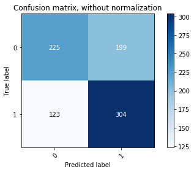


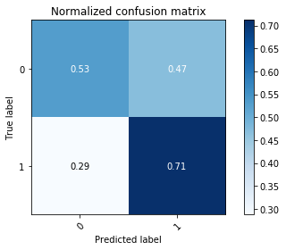


# Summary

Based on these findings above, there are a few recommendations I would provide to solidifying the fundamentals in teaching the game to someone would be:

1) Learn what champions are better in matchups against other champions

2) The most important parts of the early game for any player is to acquire gold better than their opponent to gain advantages, and not to die to the opponent's team

3) In the later phases of the game (post 20 minutes), understanding the macro strategies becomes the main focus for winning

4) Your odds of winning a game reflect the above items, plus having teammates that are comfortable with playing their selected champion, so play champions you have practices and are comfortable with

5) Winning teams ward the map more than losing teams, so continually buy wards to provide vision for your team


# Next Steps

There are a few other analysis I would like to be able to conduct as follow ups:

1) See the impact of concept importance in winning games for different ranked tiers

2) See the impact of playing games with your friends vs playing with random people


